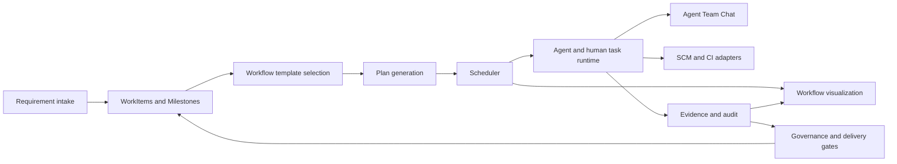

# Workflow Orchestration Engine Design

English | [中文](workflow-orchestration-engine.zh.md)

Document lifecycle:

| Status | Version | Created | Last reviewed | Review after |
| --- | --- | --- | --- | --- |
| `active` | `2026-09-11.2` | 2026-09-10 | 2026-09-11 | 2026-10-10 |

## Summary

This document describes the goals, terms, responsibilities, runtime, visualization, Agent collaboration, testing, and implementation sequence of the HuntianLing workflow engine. It guides product and engineering design; it does not claim that every capability is implemented.

The board is the main entry for requirements, tasks, Milestones, and delivery progress. The orchestration engine turns WorkItems into schedulable, auditable, and verifiable human-agent work.

## Table of Contents

- [Design Position](#design-position)
- [Harness Runtime Responsibilities](#harness-runtime-responsibilities)
- [Goals](#goals)
- [Non-Goals](#non-goals)
- [Current Implementation Boundary](#current-implementation-boundary)
- [Terms](#terms)
- [System Context](#system-context)
- [Default Agile Workflow](#default-agile-workflow)
- [Engine Architecture](#engine-architecture)
- [Workflow Template Model](#workflow-template-model)
- [Workflow Runtime Model](#workflow-runtime-model)
- [Events and State Transitions](#events-and-state-transitions)
- [Scheduler](#scheduler)
- [Priority-Ordered Story Delivery](#priority-ordered-story-delivery)
- [Agent and Skill Binding](#agent-and-skill-binding)
- [Agent Team Chat](#agent-team-chat)
- [Role-Scoped Events, Approvals, and Reviews](#role-scoped-events-approvals-and-reviews)
- [Board and Milestone Integration](#board-and-milestone-integration)
- [SCM and CI Integration](#scm-and-ci-integration)
- [Evidence and Gates](#evidence-and-gates)
- [Visualization Model](#visualization-model)
- [Workflow Test Lab](#workflow-test-lab)
- [Extension Model](#extension-model)
- [Data Model](#data-model)
- [API Groups](#api-groups)
- [Security and Governance](#security-and-governance)
- [Implementation Phases](#implementation-phases)
- [Discussion Checklist](#discussion-checklist)
- [Open Decisions](#open-decisions)

## Design Position

HuntianLing owns requirements and delivery workflow internally. GitHub, Gitea, GitLab, Jenkins, local Git, and other external systems are integrations that provide code, issue, CI, and evidence data. They are not the source of truth for requirement hierarchy or workflow state.

The engine manages four connected questions:

- What must happen next for this Project, Milestone, or WorkItem?
- Who or which Agent may do it?
- Which Skills, tools, approvals, and evidence are required?
- Why did the system start, delay, block, retry, or finish a step?

The engine must make those answers visible in the board, workflow view, Agent Team Chat, Code View, test reports, and audit records.

## Harness Runtime Responsibilities

The engine serves [the harness product direction](../requirements/harness-engineering.md). The product baseline is both faces: the standard development board as the plugin interface, and the invisible vibe-coding environment with Planner, Generator, Evaluator, and executable methods. The full service and visualization catalogs below describe the target architecture, not prerequisites for the first run. [The backlog implementation order](../requirements/backlog.md#implementation-order) owns product sequencing.

| Owner | Responsibility | First-slice evidence |
| --- | --- | --- |
| dsh runtime and execution adapters | Model/tool loop, session history, task execution, environment access, and host permission enforcement. | An actual agent task and retained tool/session references, rather than a simulated successful response. |
| HuntianLing delivery coordinator | Requirement/design version, task inputs, method/Skill selection, scheduling, scope, budget, state, handoffs, and completion decisions. | One Story linked to runnable tasks and persisted state transitions. |
| Project environment profile | Repository baseline, setup and verification commands, available tools, isolation requirements, and retained artifacts. | Successful preparation plus visible failure when a required capability is missing (`REQ-HARNESS-001`). |
| Delivery persistence | Run steps, checkpoints, decisions, pending actions, revision references, evidence links, and session references outside disposable execution. | Resume after interruption with reconciliation and no duplicate completed action (`REQ-HARNESS-002`). |
| Checks and reviewer | Reproducible behavior checks and policy-selected independent evaluation, with criterion-level findings and bounded repair. | A failed criterion returns to implementation; current evidence permits completion (`REQ-HARNESS-003`). |
| Board and collaboration projections | Requirement design, verified progress, execution activity, blockers, decisions, and human controls. | A reader can trace a delivery claim to the scope, revision, check, and reviewer that support it. |

Resolve the dsh integration API against the host source before implementation. Missing host primitives become explicit dependencies or adapters; this design does not assert that a particular host API is already available. Service responsibilities may initially share a process. Independent ownership of durable records and disposable execution does not require a distributed-service deployment.

For the first slice, use the existing deterministic Story ordering, a configurable Story WIP limit initially set to one, a versioned built-in process, local Git, and a local check runner. Show real state and evidence in the existing Runs and requirement views before adding a workflow canvas. Planner, Generator, and Evaluator are required built-in Agent definitions with separate task contexts; they may run sequentially. Specialist role expansion and a Team Chat application can follow this baseline. Persist consequential decisions and handoffs so later collaboration views can project them.

Before each run, resolve the reviewed delivery contract, relevant context and Skills, allowed tools, environment profile, required checks, and budget. Store durable checkpoints independently of context compaction. Resume must reconcile current artifacts and pending side effects; a model's recollection or a chat completion message cannot advance business state by itself. Changed scope, design, or code requires affected evidence to be revalidated. Retain a visible wait or failure when authority, evidence, or recovery is unresolved.

The standard coding workflow invokes Evaluator independently of Generator. Human review and deterministic checks supplement its evaluation, while Project policy controls review depth. The Generator cannot approve its own result or skip the Evaluator. Deterministic checks and model judgments retain distinct evidence; evaluation rubrics require calibration. Failed checks feed bounded repair; recurring failures feed measured harness improvements under `REQ-HARNESS-004`. `REQ-HARNESS-005` proves the resulting loop on this repository.

### Standard Environment Composition and Agent Handoffs

The plugin composition owns the versioned standard setup: environment/profile resolution, readiness checks, three Agent definitions, method/Skill baseline, tool bindings, checks, recovery, and board integration. It reuses the current host's compatible capabilities and prepares missing declared dependencies. A profile records what the plugin supplies, what dsh supplies, and what the project owner must provide. A repeated setup preserves project work; a ready result requires observed checks, not only generated configuration.

The coordinator creates a Planner task from board intake and repository context. Planner writes a proposed requirement/design revision; user confirmation establishes the scope. Generator proposes the implementation slice and verification plan; Evaluator checks their agreement with the accepted design. After agreement, Generator produces a candidate revision and runnable artifact. Evaluator checks that exact candidate and returns findings. The coordinator routes repair to Generator, product questions to Planner and the user, environment failures to preparation/recovery, and successful evidence to completion gates.

Each handoff records the producing and receiving Agent, Project/WorkItem/run ids, accepted design revision, candidate revision when applicable, input/output artifact references, required next action, and gate decision. The receiving Agent has its own task context and reads only relevant retained records. These fields describe required semantics, not a finalized host API. Invalid or missing outputs remain blocked; a chat message alone cannot complete the handoff.

Built-in methods execute inside these tasks. Planner's design method produces structured analysis and acceptance; Generator's implementation method applies repository conventions and checks; Evaluator's verification method produces criterion results and repair requests. The same versioned records populate the development board. Board edits that change confirmed scope invalidate affected plans and evidence and return to Planner, instead of leaving the three Agents on an obsolete specification.

The first acceptance demonstrates the delivered composition in a freshly connected project as well as HuntianLing itself (`REQ-HARNESS-001`, `REQ-HARNESS-005`, `REQ-HARNESS-006`, `REQ-HARNESS-007`). Backend setup is normally unobtrusive, but environment blockers, current Agent activity, design, findings, and progress remain visible through the standard board.

## Goals

- Use workflow templates to define repeatable agile delivery processes.
- Support Azure Boards-style WorkItem hierarchy: Epic -> Feature -> Requirement/Story -> Task, plus Bug and Research.
- Support large requirements that deliver across multiple Milestones.
- Convert requirements into executable plans with stages, steps, dependencies, gates, approvals, and evidence.
- Coordinate humans and Agents through explicit team membership, role boundaries, capacity, WIP limits, and resource leases.
- Bind executable workflow nodes to Agent roles, concrete members, required Skills, and allowed tools.
- Use `skill-creator` to create missing Skills, and validate Skills before Agents rely on them.
- Show Agent collaboration in a dedicated Agent Team Chat window, separate from the user's normal LLM task chat.
- Link code branches, commits, pull requests, reviews, CI runs, and deployment evidence back to WorkItems.
- Provide visual editing, static review, live scheduling visualization, test replay, and conformance checks.
- Let workflow packs extend events, node types, stages, transitions, gates, and approvals through declared schemas and tests.
- Run without GitHub as a hard dependency.

## Non-Goals

- The engine does not replace the board. The board remains the operating surface for requirement status and delivery progress.
- The engine does not claim universal software-domain coverage. It detects Skill gaps and creates backlog items for missing Skills.
- The engine does not make legal determinations. Project owners, compliance owners, and legal reviewers select applicable obligations.
- The engine does not let Agents coordinate through hidden model context. Collaboration that affects delivery must be visible in Agent Team Chat, WorkItems, evidence records, or audit logs.
- The engine does not treat external issues as parent-child truth. External issue trackers may mirror or import work, but HuntianLing keeps the internal hierarchy.

## Current Implementation Boundary

The current codebase provides the baseline that the engine will build on:

- Board Service persists Projects, Milestones, and WorkItems in a local JSON store.
- Requirement Service creates and decomposes Epic, Feature, Requirement, Story, Task, Bug, and Research WorkItems.
- Acceptance coverage can roll up from descendants to a parent WorkItem.
- Web Service exposes the board through a dsh display surface and JSON APIs.
- Workflow orchestration, scheduling, Agent binding, Skill binding, Workflow Test Lab, SCM adapters, CI adapters, governance packs, and advanced visualizations are planned capabilities.

## Terms

| Term | Meaning |
| --- | --- |
| Project | A project-scoped container for WorkItems, Milestones, team members, workflow templates, policies, source records, and evidence. |
| Milestone | A project-level delivery target such as release, phase, MVP, or delivery checkpoint. It is not a parent in the requirement tree. |
| WorkItem | The internal unit of requirement and delivery work. Types include Epic, Feature, Requirement, Story, Task, Bug, Research, and discussion-oriented records. |
| Delivery Slice | A portion of a large parent requirement assigned to one Milestone with its own scope, acceptance criteria, owner, and evidence. |
| Story Priority Queue | The ordered list of ready or candidate Stories that the scheduler uses to choose the next delivery focus for a Project or Milestone. |
| Story Delivery Run | One end-to-end workflow run that controls a Story from readiness through implementation, review, CI, evidence gates, and delivery. |
| Workflow Template | A versioned process definition that describes stages, transitions, nodes, gates, approvals, events, Agent bindings, Skill bindings, and tests. |
| Workflow DSL | The machine-readable representation of a workflow template. The visual designer saves to this model. |
| Stage | A lifecycle phase such as Intake, Analysis, Design, Implementation, Review, Verification, or Release. |
| Transition | A valid movement from one stage or state to another. |
| Gate | A rule that checks whether a transition or step may proceed. |
| Event | An immutable fact that says something happened, who caused it, which role they held, and which workflow object it affects. |
| State | The current durable condition of a WorkItem, workflow run, run step, Story delivery run, collaboration task, approval request, or review request. |
| State Transition | The validated change from one state to another. The engine applies it after it accepts an event, gate result, or human command. |
| Handoff | A role ownership transfer. Handoff starts with an event request and completes only when the target object's state and owner change successfully. |
| Workflow Run | One execution of a workflow template against a WorkItem, Milestone, delivery slice, or Project workflow. |
| Run Step | One runtime instance of a workflow node. |
| Plan | The ordered and conditional set of steps generated for a workflow run. |
| Scheduler | The component that decides when a ready step may start, wait, retry, reassign, or stop. |
| Scheduler Decision | A persisted explanation for a scheduling action or delay. |
| State Snapshot | The engine's captured view of WorkItem, workflow, team, branch, CI, approval, evidence, and blocker state at a decision point. |
| Agent | A human-like project member that performs defined work through explicit task specs, Skills, tools, and permissions. |
| Skill | A local instruction package or capability guide that an Agent uses for a task. |
| Tool | A callable capability such as filesystem edit, terminal command, browser automation, Git operation, document parsing, CI read, or API call. |
| Resource Lease | A short-lived claim on a WorkItem, collaboration task, repository, branch, file, environment, CI runner, or external tool. |
| Approval Request | A human decision record that allows, rejects, delegates, or requests revision for a high-risk action or state transition. |
| Review Request | A human or Agent review record that asks a required role to inspect requirement analysis, design, code, test evidence, security evidence, reliability evidence, trust evidence, or release readiness. |
| Role-Scoped Event | A workflow event that records the actor, actor role, target role, required decision role, scope, and related workflow object. |
| Evidence | A record that supports a delivery conclusion, such as acceptance coverage, code diff, test result, review, CI run, security scan, or human approval. |
| Agent Team Chat | A project conversation window for human-Agent and Agent-Agent collaboration. It is not the normal LLM task chat. |
| Workflow Pack | A versioned package that contributes workflow templates, custom events, node types, gates, forms, fixtures, and conformance tests. |
| Extension Point | A declared place where a workflow pack may add behavior, such as validation, planning, dispatch, gate evaluation, or report generation. |

## System Context

The engine sits between the board and the execution surfaces.



The board asks the engine for planned work, current workflow state, blockers, approvals, and next actions. The engine asks the board for WorkItem hierarchy, Milestone plan, acceptance coverage, dependencies, blockers, and current ownership.

## Default Agile Workflow

The default template should cover the common delivery path:

```text
Intake
  -> Analysis
  -> Design
  -> Breakdown
  -> Planning
  -> Dispatch
  -> Implementation
  -> Code Review
  -> QA Verification
  -> Security / Reliability / Trust Gates
  -> Release
  -> Retrospective
```

Projects may choose another built-in template or clone the default template. The engine should support Scrum, Kanban, Scrumban, compliance-heavy delivery, hotfix delivery, and research-only work.

## Engine Architecture

The engine should be implemented as a set of cooperating services instead of one opaque runner.

| Component | Responsibility |
| --- | --- |
| Template Manager | Creates, versions, publishes, deprecates, archives, imports, exports, selects, replaces, and rolls back workflow templates. |
| Workflow DSL Validator | Validates template schema, node references, transition rules, permission requirements, event schemas, and required tests. |
| Visual Designer | Lets users edit templates through a canvas, forms, validation markers, and version comparison. |
| Plan Generator | Converts a WorkItem or Milestone objective into executable steps with dependencies, roles, Skills, tools, checks, and evidence requirements. |
| Scheduler | Determines which steps are ready, queued, started, delayed, retried, reassigned, completed, cancelled, or blocked. |
| Agent Binder | Resolves workflow nodes to eligible humans or Agents by role, Skill, capacity, policy, and resource availability. |
| Skill Resolver | Loads only the Skills required by the selected node and records Skill versions and validation results. |
| State Recognizer | Builds a state snapshot before an Agent acts and blocks unsafe or contradictory execution. |
| State Transition Engine | Applies validated state and owner changes after events, commands, gates, approvals, and reviews pass their rules. |
| Task Runtime Adapter | Starts human tasks or Agent tasks through Harness with explicit input, output, permission, and feedback specs. |
| Role Event Engine | Validates and emits approval, review, handoff, blocker, escalation, and gate events against role policies. |
| Team Chat Adapter | Writes collaboration requests, handoffs, blockers, decisions, task updates, and verification conclusions to Agent Team Chat. |
| Board Adapter | Reads and updates WorkItems, Milestones, status, acceptance coverage, blockers, and rollups. |
| SCM Adapter | Creates and reads branches, commits, pull requests, code reviews, and merge results through local Git, GitHub, Gitea, or GitLab adapters. |
| CI Adapter | Triggers, watches, and imports CI runs, logs, artifacts, coverage, JUnit, SARIF, and browser-test reports. |
| Gate Engine | Evaluates Definition of Ready, Definition of Done, approval rules, evidence requirements, and governance controls. |
| Evidence Store | Stores links from conclusions to source documents, code, tests, CI, reviews, approvals, and Agent runs. |
| Workflow Test Lab | Executes dry-runs and conformance tests with fixtures, assertions, timelines, and replay reports. |
| Extension Manager | Loads workflow packs and allows only declared, validated extension behavior. |

## Workflow Template Model

A workflow template must describe the process before it can run. The visual designer and API should save the same versioned model.

Conceptual fields:

```yaml
template:
  id: agile-default
  version: 1.0.0
  appliesTo:
    workItemTypes: [epic, feature, requirement, story, task, bug, research]
    projectModes: [scrum, kanban, scrumban]
  publicationState: draft

stages:
  - id: analysis
    name: Analysis
    entryGate: requirement-intake-complete
    exitGate: analysis-reviewed

nodes:
  - id: analyze-requirement
    type: agent_step
    stageId: analysis
    requiredRole: business-analyst
    requiredSkills: [requirement-analysis]
    allowedTools: [document-read, board-update]
    inputs: [source-documents, work-item-context]
    outputs: [analysis-notes, open-questions]
    evidence: [agent-run, reviewed-analysis]

transitions:
  - from: analysis
    to: design
    requires: [analysis-reviewed]

events:
  - name: workflow.analysis.completed
    visibility: [team_chat, audit]
```

The exact DSL syntax can change during implementation. The required invariant is that visual nodes, runtime steps, Agent tasks, Team Chat events, evidence records, and audit records all keep stable ids and version references.

## Workflow Runtime Model

A workflow run is created when a Project, Milestone, WorkItem, or delivery slice starts a selected template.

Runtime lifecycle:

1. The engine resolves the selected workflow template version.
2. The engine builds a state snapshot from board, team, branch, CI, approval, evidence, and blocker data.
3. The planner generates executable steps and dependencies.
4. The scheduler places ready steps into queues.
5. The Agent Binder or human assignment policy selects eligible owners.
6. The runtime starts the step only after gates, approvals, capacity, Skills, tools, and resource leases allow it.
7. The running member writes output, evidence, questions, blockers, and task updates.
8. The Role Event Engine records the emitted event with actor, role, target, reason, and correlation id.
9. The State Transition Engine validates the event against the current state, role policy, gates, approvals, evidence, and resource leases.
10. The engine applies the accepted state transition atomically and writes the resulting state.
11. The board, Agent Team Chat, Code View, evidence store, and audit log receive the visible result.

Workflow run states should include:

- `draft`
- `planned`
- `ready`
- `running`
- `waiting_for_input`
- `waiting_for_approval`
- `blocked`
- `paused`
- `completed`
- `failed`
- `cancelled`

Run step states should include:

- `pending`
- `ready`
- `queued`
- `scheduled`
- `running`
- `waiting_for_input`
- `waiting_for_approval`
- `blocked`
- `retrying`
- `completed`
- `failed`
- `skipped`
- `cancelled`

## Events and State Transitions

The engine must use events and states together.

Events answer:

- what happened;
- who did it;
- which role they held;
- which object they affected;
- why it happened;
- which evidence, approval, review, branch, CI run, or source document supports it.

States answer:

- where the object is now;
- who owns it now;
- whether it can continue;
- which step or role is waiting;
- whether it is blocked, running, reviewing, verifying, completed, or cancelled.

State transitions answer:

- whether an event is allowed in the current state;
- whether the actor's role may perform the action;
- whether required gates, approvals, evidence, Skills, tools, and resources are satisfied;
- which state and owner should be written next.

The handoff rule is: an event initiates or records the handoff, and the accepted state transition completes the handoff. A handoff is not complete when only a chat message, event, or approval record exists. It is complete only when the target object moves to the next state and the receiving role or member becomes the current owner.

Examples:

| Situation | Event | State transition |
| --- | --- | --- |
| Developer finishes implementation | `task.complete` from Developer | Run step moves from `running` to `ready_for_review`; owner changes to Reviewer role or review queue. |
| Reviewer accepts review | `review.assigned` from Reviewer | Review request moves from `requested` to `in_review`; run step waits on review completion. |
| Reviewer approves | `review.approved` from Reviewer | Run step moves from `in_review` to `ready_for_verification` when required quorum and gates pass. |
| QA requests changes | `review.changes_requested` from QA | Story delivery run moves back to `implementation_required` or `blocked` with reason. |
| Product Owner approves release | `approval.approved` from Product Owner | Release gate moves from `waiting_for_approval` to `passed` when role policy and separation of duties pass. |

The engine should persist both the event log and the current state. Event replay can rebuild history and explain decisions, but normal board and scheduler reads should use the current state tables for fast, clear progress.

## Scheduler

The scheduler controls when plan steps start. It must never start every generated step immediately.

The scheduler should evaluate:

- step dependencies;
- WorkItem status and parent-child coverage;
- Story priority queue rank;
- Milestone and delivery-slice priority;
- gate results and missing evidence;
- approval state;
- required role, Skill, and tool availability;
- team member availability, capacity, and WIP limits;
- resource leases for repositories, branches, files, CI runners, environments, and tools;
- branch status, merge conflicts, stale bases, and protected-branch policies;
- CI state and required checks;
- retry policy, timeout, deadline risk, and starvation prevention.

Each scheduler decision must be persisted with a reason. A user must be able to inspect why a step was scheduled, delayed, blocked, retried, cancelled, or reassigned.

Recommended decision states:

| Decision | Meaning |
| --- | --- |
| `ready` | Dependencies and gates allow the step to enter the queue. |
| `queued` | The step waits for an eligible member or resource. |
| `scheduled` | The scheduler selected a start path and owner. |
| `delayed` | The step cannot start yet because of time, priority, capacity, or policy. |
| `blocked` | The step lacks required input, approval, Skill, tool, evidence, or resource. |
| `retried` | The step failed or timed out and policy allows another attempt. |
| `reassigned` | Ownership changed because of capacity, decline, failure, or human override. |
| `cancelled` | A human, policy, or upstream state cancelled the step. |

## Priority-Ordered Story Delivery

Priority decides which Story should be considered first. Readiness, capacity, Skills, tools, approvals, evidence, and resources decide whether that Story can actually start.

The control loop should work like this:

1. The selected prioritization method ranks candidate Stories for a Project or Milestone.
2. The Story priority queue records rank, method inputs, dependency state, risk, deadline, Milestone, delivery slice, blocked state, and override reason.
3. The scheduler checks the highest-ranked Story against Definition of Ready.
4. The scheduler starts a Story delivery run only when required analysis, design, acceptance criteria, dependencies, approvals, Skills, tools, team capacity, WIP limits, and resource leases are satisfied.
5. The Story delivery run becomes the control envelope for child Tasks, Agent collaboration tasks, role-scoped approval and review events, branch work, CI runs, and evidence.
6. The scheduler may run safe internal steps in parallel, but it must respect dependencies, role boundaries, resource leases, and approval gates.
7. The scheduler skips a higher-ranked Story only when it is blocked, not ready, missing a required role, missing Skills, missing tools, waiting for approval, or blocked by resources.
8. Each skip, start, pause, retry, reassign, and completion decision receives a persisted scheduler reason.
9. The Story can reach delivered state only after acceptance coverage, child WorkItem completion, review decisions, approval events, code evidence, CI evidence, configured gates, and Definition of Done pass.

This model supports both focused delivery and controlled concurrency. A Project can set Story-level WIP limits so the team works on one Story at a time, one Story per Milestone, or several Stories in parallel. The engine should prevent parallel Story work from creating duplicate ownership, branch conflicts, overloaded reviewers, or shared CI and environment contention.

The board should show the Story queue, active Story delivery runs, skipped high-priority Stories, blocked reasons, and completion evidence. The runtime scheduler timeline should show how each Story moved from ranked candidate to ready, queued, running, blocked, verifying, or delivered.

## Agent and Skill Binding

Executable nodes bind to roles first and concrete members second.

Binding order:

1. Read node requirements: role, Skills, tools, input fields, output fields, checks, approval rules, and risk level.
2. Resolve eligible project members by role and capability profile.
3. Remove members blocked by region, permissions, availability, WIP limit, resource lease, or missing Skill.
4. Resolve required Skills and Skill packs.
5. Validate Skill versions against the task type and project tech profile.
6. Create or recommend Skill Gap WorkItems when coverage is missing.
7. Select the member through assignment policy or human approval.
8. Write the binding decision to workflow run history and Agent Team Chat.

Agents must perform state recognition before executing a step. An Agent must stop when the state snapshot is stale, incomplete, contradictory, outside the role boundary, or missing required approval.

## Agent Team Chat

Agent Team Chat is the developer-shell Agent Channel. It is not the customer MKT dialog and not a normal LLM task chat. Messages use the envelope and `type` catalog in `REQ-COLLAB-004`.

The chat should show:

- human messages;
- Agent messages;
- structured task messages;
- handoff messages;
- blockers and unblock events;
- approval requests and approval results;
- review requests and verification conclusions;
- tool evidence and system events.

Structured messages may create and update collaboration tasks. A collaboration task can be accepted, declined, transferred, split, merged, blocked, unblocked, reviewed, completed, rejected, or cancelled.

Messages may reference Project, Milestone, WorkItem, delivery slice, branch, pull request, CI run, source document, or evidence record. Those references are tags for navigation and traceability; they do not turn the chat into the board, Code View, SCM tool, CI tool, or normal LLM task window.

## Role-Scoped Events, Approvals, and Reviews

Approvals and reviews are workflow events with role rules. They must not exist only as WorkItem fields, chat messages, or boolean status values.

A role-scoped event should record:

- event type;
- actor and actor role;
- requester role;
- target role;
- reviewer role or approver role when applicable;
- required decision role;
- delegated role when applicable;
- Project, Milestone, WorkItem, delivery slice, workflow run, and run step;
- branch, pull request, CI run, source document, and evidence references when applicable;
- reason, decision, timestamp, correlation id, and audit id.

Approval event examples:

- `approval.requested`;
- `approval.assigned`;
- `approval.approved`;
- `approval.rejected`;
- `approval.revision_requested`;
- `approval.delegated`;
- `approval.expired`;
- `approval.cancelled`;
- `approval.escalated`.

Review event examples:

- `review.requested`;
- `review.assigned`;
- `review.started`;
- `review.commented`;
- `review.approved`;
- `review.changes_requested`;
- `review.rejected`;
- `review.completed`;
- `review.cancelled`.

Workflow templates should declare which roles may emit each approval or review event, which roles must decide, whether approval must be sequential or parallel, whether quorum is required, whether delegation is allowed, and whether separation of duties applies.

The scheduler and Gate Engine should use these events as inputs. A step can wait for a Product Owner approval, a Security Reviewer review, a QA verification decision, or a Compliance Owner signoff by subscribing to the required role-scoped event predicates. Wrong-role decisions, missing required roles, expired approvals, and conflicting review decisions must block the dependent step and produce visible scheduler reasons.

Agent Team Chat should show the same events as conversation entries so humans can see who requested review, which role owns the response, what decision was made, and what remains unresolved.

## Board and Milestone Integration

The board remains the main product surface.

The workflow engine should write these outputs back to the board:

- current workflow stage;
- active owner;
- running steps;
- blocked steps;
- waiting approvals;
- failed checks;
- missing fields;
- next recommended action;
- expected downstream impact;
- acceptance coverage;
- delivery evidence;
- milestone rollup changes.

Large parent requirements can span multiple Milestones through delivery slices. Each slice keeps its own scope, acceptance criteria, owner, evidence, and Milestone. The parent WorkItem rolls up status across all slices and cannot be delivered until required slices meet the configured Definition of Done.

## SCM and CI Integration

SCM and CI are evidence providers and controlled execution surfaces.

The workflow engine should support:

- repository registration per Project;
- branch creation linked to WorkItems, Milestones, fixes, experiments, or release stabilization;
- branch naming and protected-branch policies;
- stale branch and merge-conflict detection;
- patch generation, commit creation, push, pull request creation, review request, merge request, and merge as separate auditable actions;
- GitHub, Gitea, GitLab, and local Git adapters;
- CI discovery, trigger, wait, log import, artifact import, and report parsing;
- CI evidence linked to WorkItems, Milestones, acceptance criteria, and delivery gates.

Agent permissions must separate read-only inspection, file editing, commit creation, branch push, pull request creation, CI trigger, review approval, deployment, and merge.

## Evidence and Gates

The engine should block delivery when required evidence is missing.

Evidence categories:

- source document and intake provenance;
- analysis and design review events;
- acceptance criteria coverage;
- child WorkItem completion;
- code changes and diffs;
- code review decisions;
- test results;
- CI runs and artifacts;
- security scans and threat models;
- reliability tests and rollback plans;
- AI provenance and trust assessments;
- approval decisions;
- audit events.

Gate types:

- Definition of Ready;
- Definition of Done;
- human approval;
- acceptance coverage;
- dependency completion;
- code submission evidence;
- CI success;
- security control evidence;
- reliability evidence;
- AI trust and provenance;
- release readiness;
- compliance or certification control.

## Visualization Model

The workflow UI should provide three linked modes.

### Static Workflow Map

The static view helps authors and reviewers understand a template before it runs.

Recommended layout:

- left panel: workflow outline, stages, node list, validation filters;
- center canvas: stage swimlanes, role swimlanes, dependencies, parallel branches, gates, approvals, retries, timers, and failure paths;
- right panel: selected node inspector;
- bottom panel: validation issues, changed nodes, and publication blockers.

The static map should support layer toggles for lifecycle, Agents, Skills, tools, events, gates, approvals, evidence, source documents, risks, and compliance controls.

### Runtime Scheduler Timeline

The runtime view helps users understand live execution and scheduling.

Recommended layout:

- center canvas: current node states and dependency edges;
- timeline: ready, queued, assigned, started, paused, retried, reassigned, completed, blocked, failed, and cancelled timestamps;
- swimlanes: roles, Agents, human members, resource leases, and CI resources;
- event stream: scheduler decisions, Team Chat events, evidence updates, approval changes, branch changes, and CI changes;
- inspector: selected step input, output, owner, Skills, tools, evidence, and reason.

The runtime view must explain delays and blockers without requiring users to read server logs.

### Test Replay View

The test view helps workflow authors prove that a template behaves as expected.

Recommended layout:

- scenario panel: fixture, WorkItem, Milestone, team, Agent, Skill, tool, branch, CI, approval, and evidence inputs;
- replay canvas: visual playback over the same workflow map;
- assertion panel: expected final state, expected events, expected tasks, expected gates, and expected evidence;
- diff panel: expected versus actual node order, event order, created tasks, gate results, approvals, audit events, and evidence records.

The test replay report should become publication evidence for workflow templates and debugging evidence for third-party workflow packs.

## Workflow Test Lab

Workflow Test Lab should validate templates before Projects use them.

Required scenario categories:

- happy path;
- missing input;
- missing Skill;
- missing tool;
- missing approval;
- wrong-role approval;
- expired approval;
- delegated review;
- conflicting review decisions;
- stale or contradictory state;
- blocked task;
- failed gate;
- failed CI;
- declined handoff;
- timeout;
- retry;
- cancellation;
- resource conflict;
- cross-Milestone delivery;
- unsafe permission request;
- custom event validation failure;
- custom node simulation.
- event-driven state transition;
- rejected stale event;
- successful role handoff.
- priority queue selection;
- blocked top-priority Story;
- Story-level WIP limit;
- end-to-end Story delivery.

Test cases should assert:

- final workflow run status;
- run step order and states;
- emitted events;
- created collaboration tasks;
- Agent Team Chat messages;
- gate results;
- evidence records;
- blocked reasons;
- approval requests;
- audit events;
- conformance report results.

## Extension Model

The engine should allow customization through declared workflow packs.

A workflow pack may provide:

- workflow templates;
- custom event types;
- custom plan node types;
- stage definitions;
- transition rules;
- gate types;
- approval rules;
- UI form schemas;
- test fixtures;
- conformance tests;
- documentation.

The engine must block a workflow pack when it uses unknown node types, undeclared tools, missing Skills, unsafe permissions, untested high-risk paths, invalid event schemas, or conflicting extension points.

Extension points should exist for:

- template validation;
- plan generation;
- dispatch recommendation;
- step start;
- step completion;
- gate evaluation;
- evidence ingestion;
- approval request creation;
- review request creation;
- role-event validation;
- event emission;
- failure handling;
- report generation.

## Data Model

The database should support SQLite for local deployment and PostgreSQL for team deployment. Large files should use local filesystem storage in the baseline, with database records for metadata, hashes, extracted text status, and references.

Core workflow entities:

- `workflow_templates`;
- `workflow_canvas_versions`;
- `workflow_stages`;
- `workflow_transitions`;
- `workflow_runs`;
- `workflow_run_steps`;
- `workflow_plan_schedules`;
- `workflow_step_queue_items`;
- `workflow_scheduler_decisions`;
- `workflow_state_snapshots`;
- `workflow_state_transition_rules`;
- `workflow_state_transitions`;
- `workflow_handoff_requests`;
- `workflow_handoff_acceptances`;
- `workflow_role_event_policies`;
- `workflow_event_role_bindings`;
- `workflow_review_requests`;
- `workflow_review_decisions`;
- `workflow_approval_decisions`;
- `story_priority_queues`;
- `story_priority_queue_items`;
- `story_delivery_runs`;
- `story_delivery_checkpoints`;
- `workflow_visual_views`;
- `workflow_visual_exports`;
- `workflow_runtime_trace_events`;
- `workflow_runtime_timelines`;
- `workflow_test_cases`;
- `workflow_test_runs`;
- `workflow_test_assertions`;
- `workflow_test_replay_frames`;
- `workflow_simulation_fixtures`;
- `workflow_publication_reviews`;
- `workflow_conformance_results`;
- `workflow_event_types`;
- `workflow_plan_node_types`;
- `workflow_extension_points`;
- `workflow_extension_packages`;
- `workflow_builtin_capabilities`;
- `workflow_template_selections`;
- `workflow_template_replacements`;
- `workflow_agent_bindings`;
- `workflow_skill_bindings`;
- `workflow_gate_results`;
- `workflow_handoffs`;
- `workflow_automation_rules`.

Connected entities:

- `projects`;
- `milestones`;
- `work_item_milestone_slices`;
- `work_items`;
- `acceptance_criteria`;
- `work_item_acceptance_coverage`;
- `team_members`;
- `team_member_roles`;
- `team_member_availability`;
- `team_capacity_allocations`;
- `team_wip_policies`;
- `team_work_assignments`;
- `team_resource_leases`;
- `team_conversations`;
- `team_messages`;
- `team_message_links`;
- `agent_collaboration_tasks`;
- `agent_collaboration_task_events`;
- `agent_capability_profiles`;
- `agent_state_recognition_results`;
- `scm_repositories`;
- `scm_branches`;
- `scm_changesets`;
- `scm_pull_requests`;
- `control_evidence`;
- `approval_requests`;
- `audit_events`.

## API Groups

The backlog owns the detailed endpoint list. The engine should expose these API groups:

| API group | Purpose |
| --- | --- |
| Workflow templates | Create, edit, validate, publish, archive, import, export, clone, select, replace, and roll back templates. |
| Canvas and visualization | Read and save visual canvases, static maps, layers, exports, and version diffs. |
| Workflow runs | Create, start, pause, resume, cancel, retry, replay, and inspect runs. |
| Story queue and delivery | Recompute Story priority queues, start Story delivery runs, inspect active Story progress, and control Story-level WIP. |
| Events and state transitions | Emit events, validate transition rules, inspect accepted and rejected state changes, and control role handoffs. |
| Schedule and decisions | Read schedules, recompute plans, inspect queue state, and inspect scheduler decision reasons. |
| Plan nodes and events | Register, validate, and query built-in and custom nodes, events, and schemas. |
| Role events, approvals, and reviews | Declare role-event policies, emit approval and review events, inspect pending decisions, and validate role authorization. |
| Agent and Skill binding | Resolve eligible members, bind nodes to Agents, bind Skills, start Agent steps, and inspect state recognition. |
| Test Lab | Manage test cases, execute dry-runs, read reports, export replay evidence, and run conformance suites. |
| Team Chat tasks | Create and update collaboration tasks through structured messages. |
| Gates and approvals | Read gate state, request approvals, record decisions, and block or unblock transitions. |
| SCM and CI | Link branches, commits, pull requests, CI runs, reports, and delivery evidence. |
| Evidence and audit | Store evidence, generate reports, sign attestations, and inspect audit events. |

## Security and Governance

The engine should enforce security and governance through policy, not convention.

Required controls:

- authentication for web and API access;
- project-level authorization for reads and writes;
- role-based and capability-based Agent permissions;
- role-scoped approval and review event authorization;
- human approval for high-risk actions;
- secure password hashing through Argon2id, bcrypt, or PBKDF2;
- OAuth adapters for Google, GitHub, and WeChat;
- regional login routing for domestic and international access;
- audit events for template changes, workflow actions, Agent actions, approval events, review events, SCM operations, CI triggers, evidence changes, and policy overrides;
- redaction policies for sensitive source documents, prompts, logs, and tool outputs;
- evidence retention policies per Project and compliance obligation;
- immutable report snapshots for release, audit, and certification decisions.

Governance packs should map legal, certification, security, reliability, and AI trust obligations to WorkItems, gates, checks, evidence, approvals, and reports.

## Implementation Phases

Follow [the backlog implementation order](../requirements/backlog.md#implementation-order). The first engine slice composes a reusable standard environment, all three built-in Agents, executable default methods, durable progress, local Git/check evidence, bounded repair, and the standard development board. Prove new-project onboarding and self-development with the same composition. Exercise failure and recovery before broadening the workflow language or provider set.

Durability sufficient for safe resume is required in that slice; supporting both SQLite and PostgreSQL is not. Basic permissions and isolation are required before execution; regional OAuth and certification packs follow deployment needs. Runnable workflow tests precede production use, while the visual designer and graphical Test Lab replay can follow the demonstrated runtime.

## Discussion Checklist

Use this checklist when the team reviews the engine design:

- Can product users explain the difference between board, workflow, and Agent Team Chat?
- Can a parent requirement show every child, delivery slice, Milestone, acceptance criterion, and evidence record?
- Can the visual designer show static process structure without requiring a real run?
- Can the scheduler select the highest-priority ready Story and explain why any higher-ranked Story was skipped?
- Can one Story show its full path from readiness through implementation, review, CI, evidence gates, and delivered status?
- Can every role handoff show the triggering event, accepted state transition, previous owner, next owner, and rejection reason when it fails?
- Can the runtime view explain every scheduler decision?
- Can the test lab replay a failed workflow and show expected-versus-actual differences?
- Can every Agent action be traced to role, Skill, tool, input, output, permission, and evidence?
- Can each approval or review show requester role, reviewer or approver role, decision role, delegation, quorum, and resulting gate change?
- Can humans approve or stop high-risk actions before the Agent performs them?
- Can teams run without GitHub?
- Can external users access the web URL with authentication and project authorization?
- Can a third-party workflow pack prove conformance before a Project enables it?
- Can missing Skills become visible backlog work instead of hidden assumptions?
- Can governance controls block delivery when evidence is missing?

## Open Decisions

- Which workflow DSL syntax should become the stable interchange format?
- Which graph rendering library should power the visual designer and runtime map?
- How much of the Agent Team Chat message schema must be fixed before the first workflow run?
- Which governance control pack should be the first built-in pack?
- How should workflow pack permissions be reviewed before installation?
- What retention policy should apply to prompts, tool outputs, CI logs, and replay frames?
