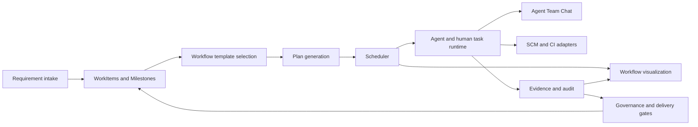

# 工作流编排引擎设计

[English](workflow-orchestration-engine.md) | 中文

文档生命周期：

| 状态 | 版本 | 创建日期 | 最近复审 | 下次复审 |
| --- | --- | --- | --- | --- |
| `active` | `2026-09-11.2` | 2026-09-10 | 2026-09-11 | 2026-10-10 |

## 摘要

本文档整理 HuntianLing 工作流编排引擎的目标、术语、能力边界、运行模型、可视化方式、Agent 协作方式、测试方式和落地顺序。它用于团队继续讨论产品方案和工程方案，不代表当前代码已经全部实现。

HuntianLing 的编排引擎不替代看板。看板仍然是需求、任务、里程碑和交付进度的主要入口；编排引擎负责把 WorkItem 变成可调度、可审计、可验证的人机协作流程。

## 目录

- [设计定位](#设计定位)
- [Harness 运行时职责](#harness-运行时职责)
- [目标](#目标)
- [非目标](#非目标)
- [当前实现边界](#当前实现边界)
- [术语](#术语)
- [系统上下文](#系统上下文)
- [默认敏捷工作流](#默认敏捷工作流)
- [引擎架构](#引擎架构)
- [工作流模板模型](#工作流模板模型)
- [工作流运行模型](#工作流运行模型)
- [事件和状态流转](#事件和状态流转)
- [调度器](#调度器)
- [按优先级排序的 Story 交付](#按优先级排序的-story-交付)
- [Agent 和 Skill 绑定](#agent-和-skill-绑定)
- [Agent Team Chat](#agent-team-chat)
- [角色范围事件、审批和评审](#角色范围事件审批和评审)
- [看板和里程碑集成](#看板和里程碑集成)
- [SCM 和 CI 集成](#scm-和-ci-集成)
- [证据和门禁](#证据和门禁)
- [可视化模型](#可视化模型)
- [工作流测试实验室](#工作流测试实验室)
- [扩展模型](#扩展模型)
- [数据模型](#数据模型)
- [API 分组](#api-分组)
- [安全和治理](#安全和治理)
- [实现阶段](#实现阶段)
- [讨论检查清单](#讨论检查清单)
- [未决决策](#未决决策)

## 设计定位

HuntianLing 在内部拥有需求和交付工作流。GitHub、Gitea、GitLab、Jenkins、本地 Git 和其他外部系统都是代码、issue、CI 和证据数据的集成来源，不是需求层级或工作流状态的事实源。

引擎管理四个相互关联的问题：

- 对这个 Project、Milestone 或 WorkItem，下一步必须发生什么？
- 谁或哪个 Agent 可以执行？
- 需要哪些 Skills、工具、审批和证据？
- 系统为什么启动、延迟、阻塞、重试或完成一个步骤？

这些答案必须在看板、工作流视图、Agent Team Chat、Code View、测试报告和审计记录中可见。

## Harness 运行时职责

引擎服务于 [Harness 产品定位](../requirements/harness-engineering.zh.md)。产品基线是两面：作为插件界面的标准开发看板，以及包含 Planner、Generator、Evaluator 和可执行方法的不可见 vibe coding 环境。下文完整的服务与可视化目录描述目标架构，不是首次运行的前提。[Backlog 实现顺序](../requirements/backlog.zh.md#实现顺序) 负责产品交付排序。

| 负责方 | 职责 | 首个切片的证据 |
| --- | --- | --- |
| dsh 运行时与执行适配器 | 模型/工具循环、会话历史、任务执行、环境访问和宿主权限执行。 | 真实 Agent 任务及保留的工具/会话引用，而非模拟成功响应。 |
| HuntianLing 交付协调器 | 需求/设计版本、任务输入、方法/Skill 选择、调度、范围、预算、状态、交接和完成决策。 | 一个 Story 关联可运行任务和持久化状态流转。 |
| 项目环境配置 | 仓库基线、准备和验证命令、可用工具、隔离要求和保留产物。 | 准备成功，缺少必需能力时显示失败（`REQ-HARNESS-001`）。 |
| 交付持久化 | 在可丢弃执行环境外保存运行步骤、检查点、决策、待执行操作、版本引用、证据链接和会话引用。 | 中断后核对状态并恢复，不重复已完成操作（`REQ-HARNESS-002`）。 |
| 检查与评审者 | 可复现的行为检查，以及策略选择的独立评价，给出逐项结论并支持有界修复。 | 失败标准返回实现，当前有效证据允许完成（`REQ-HARNESS-003`）。 |
| 看板与协作投影 | 需求设计、已验证进度、执行活动、阻塞、决策和人工控制。 | 读者可以将交付结论追踪到支撑它的范围、版本、检查和评审者。 |

实现前必须对照宿主源码确定 dsh 集成 API。缺失的宿主原语成为明确依赖或适配器，本设计不宣称某个具体宿主 API 已经可用。服务职责初期可以在同一进程中实现；持久记录与可丢弃执行各有归属，不要求部署为分布式服务。

首个切片采用现有确定性 Story 排序、初始配置为一的可配置 Story WIP 限制、有版本的内置流程、本地 Git 和本地检查执行器。先在现有 Runs 和需求视图展示真实状态与证据，再增加工作流画布。Planner、Generator 和 Evaluator 是必需的内置 Agent 定义，具备各自任务上下文，可以顺序运行。专业角色扩展和 Team Chat 应用可以在这一基线后加入。重要决策和交接必须持久化，供后续协作视图投影。

每次运行前解析经过评审的交付契约、相关上下文和 Skill、允许的工具、环境配置、必需检查和预算。持久检查点独立于上下文压缩保存。恢复必须核对当前产物和待确定副作用；模型回忆或聊天完成消息不能单独推进业务状态。范围、设计或代码变化后，受影响证据必须重新验证。权限、证据或恢复未解决时保持可见等待或失败。

标准编码流程独立于 Generator 调用 Evaluator。人工评审和确定性检查补充其评价，项目策略控制评审深度。Generator 不能自行批准结果或跳过 Evaluator。确定性检查和模型判断保留不同证据，评价准则需要校准。检查失败进入有界修复，重复失败按 `REQ-HARNESS-004` 进入可衡量的 Harness 改进。`REQ-HARNESS-005` 在本仓库证明这个闭环。

### 标准环境组合与 Agent 交接

插件组合负责有版本的标准配置：环境/项目配置解析、就绪检查、三个 Agent 定义、方法/Skill 基线、工具绑定、检查、恢复和看板集成。它复用当前宿主的兼容能力，准备声明中缺少的依赖。配置记录哪些由插件提供、哪些由 dsh 提供、哪些由项目负责人提供。重复准备保留项目工作；就绪结论必须有实际检查结果，仅生成配置不足以证明就绪。

协调器从看板录入和仓库上下文创建 Planner 任务。Planner 写出需求/设计草案版本，由用户确认范围。Generator 提出实现切片和验证计划，Evaluator 检查它们是否符合已接受设计。达成一致后，Generator 产生候选版本和可运行产物。Evaluator 检查该确切候选并返回发现。协调器将修复交给 Generator，将产品问题交给 Planner 和用户，将环境失败交给准备/恢复流程，将通过的证据交给完成门禁。

每次交接记录产生和接收 Agent、Project/WorkItem/run 标识、已接受设计版本、适用的候选版本、输入/输出产物引用、必需下一步和门禁决定。接收 Agent 拥有自己的任务上下文，只读取相关的保留记录。这些字段描述必需语义，不是已经定稿的宿主 API。输出无效或缺失时保持阻塞，聊天消息不能单独完成交接。

内置方法在这些任务中执行。Planner 的设计方法产生结构化分析和验收；Generator 的实现方法应用仓库规范和检查；Evaluator 的验证方法产生逐项结果及修复请求。同一组有版本记录填入开发看板。看板编辑改变已确认范围时，受影响计划和证据失效并返回 Planner，不能让三个 Agent 继续使用过期规格。

首次验收既要在新接入项目中演示交付的组合，也要在 HuntianLing 自身演示（`REQ-HARNESS-001`、`REQ-HARNESS-005`、`REQ-HARNESS-006`、`REQ-HARNESS-007`）。后台准备通常无感，但环境阻塞、当前 Agent 活动、设计、发现和进度仍通过标准看板可见。

## 目标

- 用工作流模板定义可重复的敏捷交付流程。
- 支持 Azure Boards 风格 WorkItem 层级：Epic -> Feature -> Requirement/Story -> Task，同时支持 Bug 和 Research。
- 支持大型需求跨多个 Milestone 交付。
- 把需求转换为包含阶段、步骤、依赖、门禁、审批和证据的可执行计划。
- 通过明确的团队成员、角色边界、容量、WIP 限制和资源租约协调人和 Agent。
- 把可执行工作流节点绑定到 Agent 角色、具体成员、必需 Skills 和允许工具。
- 使用 `skill-creator` 创建缺失 Skills，并在 Agent 依赖 Skills 前完成验证。
- 在独立 Agent Team Chat 窗口展示 Agent 协作，不与用户普通 LLM 任务聊天混用。
- 把代码分支、提交、PR、评审、CI run 和部署证据回链到 WorkItems。
- 提供可视化编辑、静态审查、实时调度可视化、测试回放和一致性检查。
- 允许 workflow packs 通过声明 schema 和测试扩展事件、节点类型、阶段、状态流转、门禁和审批。
- 不把 GitHub 作为硬依赖。

## 非目标

- 引擎不替代看板；看板仍然是需求状态和交付进度的操作界面。
- 引擎不承诺覆盖所有软件领域；它检测 Skill 缺口，并把缺失 Skills 创建成 backlog work。
- 引擎不作法律结论；项目负责人、合规负责人和法律评审者选择适用义务。
- Agent 不通过隐藏模型上下文协作；影响交付的协作必须出现在 Agent Team Chat、WorkItems、证据或审计记录中。
- 外部 issue 不能作为父子关系事实源；外部 issue tracker 可以镜像或导入工作，但 HuntianLing 保存内部层级。

## 当前实现边界

当前代码提供引擎将要依赖的基线：

- Board Service 在本地 JSON store 中持久化 Projects、Milestones 和 WorkItems。
- Requirement Service 创建并拆分 Epic、Feature、Requirement、Story、Task、Bug 和 Research WorkItems。
- 验收覆盖度可以从后代 WorkItems 汇总到父 WorkItem。
- Web Service 通过 dsh display surface 和 JSON APIs 暴露看板。
- 工作流编排、调度、Agent 绑定、Skill 绑定、Workflow Test Lab、SCM adapters、CI adapters、governance packs 和高级可视化仍是计划能力。

## 术语

| 术语 | 含义 |
| --- | --- |
| Project | 项目级容器，包含 WorkItems、Milestones、团队成员、工作流模板、策略、源记录和证据。 |
| Milestone | 项目级交付目标，例如版本、阶段、MVP 或交付检查点。它不是需求树父节点。 |
| WorkItem | 需求和交付工作的内部单位。类型包含 Epic、Feature、Requirement、Story、Task、Bug、Research 和讨论型记录。 |
| Delivery Slice | 大型父需求的一部分，分配给一个 Milestone，拥有独立范围、验收标准、负责人和证据。 |
| Story Priority Queue | 调度器用于选择 Project 或 Milestone 下一交付焦点的 ready 或候选 Stories 有序列表。 |
| Story Delivery Run | 控制一个 Story 从 ready 到实现、评审、CI、证据门禁和交付的端到端工作流运行。 |
| Workflow Template | 版本化流程定义，描述阶段、状态流转、节点、门禁、审批、事件、Agent 绑定、Skill 绑定和测试。 |
| Workflow DSL | 工作流模板的机器可读表示；可视化设计器保存到该模型。 |
| Stage | 生命周期阶段，例如 Intake、Analysis、Design、Implementation、Review、Verification 或 Release。 |
| Transition | 从一个阶段或状态移动到另一个阶段或状态的有效规则。 |
| Gate | 检查状态流转或步骤是否可以继续的规则。 |
| Event | 不可变事实，记录发生了什么、谁触发、其角色、影响哪个工作流对象。 |
| State | WorkItem、workflow run、run step、Story delivery run、协作任务、审批请求或评审请求的当前持久条件。 |
| State Transition | 从一个状态到另一个状态的验证后变化。引擎接受事件、门禁结果或人工命令后应用它。 |
| Handoff | 角色所有权转移。交接从事件请求开始，只有目标对象状态和 owner 成功变化后才完成。 |
| Workflow Run | 对 WorkItem、Milestone、delivery slice 或 Project workflow 执行一次 workflow template。 |
| Run Step | workflow node 的一次运行时实例。 |
| Plan | 为 workflow run 生成的有序、条件化步骤集合。 |
| Scheduler | 决定 ready step 何时启动、等待、重试、重新分配或停止的组件。 |
| Scheduler Decision | 对一次调度动作或延迟的持久化解释。 |
| State Snapshot | 引擎在决策点捕获的 WorkItem、workflow、team、branch、CI、approval、evidence 和 blocker 状态。 |
| Agent | 通过明确任务规格、Skills、工具和权限执行工作的类人项目成员。 |
| Skill | Agent 为任务使用的本地 instruction package 或能力指南。 |
| Tool | 可调用能力，例如文件编辑、终端命令、浏览器自动化、Git 操作、文档解析、CI 读取或 API 调用。 |
| Resource Lease | 对 WorkItem、协作任务、仓库、分支、文件、环境、CI runner 或外部工具的短期占用。 |
| Approval Request | 人工决策记录，用于允许、拒绝、委托或要求高风险动作或状态流转修改。 |
| Review Request | 要求特定角色检查需求分析、设计、代码、测试证据、安全证据、可靠性证据、可信证据或发布就绪度的评审记录。 |
| Role-Scoped Event | 记录 actor、actor role、target role、required decision role、scope 和相关工作流对象的工作流事件。 |
| Evidence | 支撑交付结论的记录，例如验收覆盖、代码 diff、测试结果、评审、CI run、安全扫描或人工审批。 |
| Agent Team Chat | 用于人和 Agent、Agent 和 Agent 协作的项目对话窗口，不是普通 LLM 任务聊天。 |
| Workflow Pack | 提供工作流模板、自定义事件、节点类型、门禁、表单、fixtures 和一致性测试的版本化包。 |
| Extension Point | workflow pack 可以增加行为的声明位置，例如 validation、planning、dispatch、gate evaluation 或 report generation。 |

## 系统上下文

引擎位于看板和执行表面之间。



看板向引擎查询计划工作、当前工作流状态、阻塞、审批和下一步动作。引擎向看板读取 WorkItem 层级、Milestone 计划、验收覆盖、依赖、阻塞和当前 owner。

## 默认敏捷工作流

默认模板应覆盖常见交付路径：

```text
Intake
  -> Analysis
  -> Design
  -> Breakdown
  -> Planning
  -> Dispatch
  -> Implementation
  -> Code Review
  -> QA Verification
  -> Security / Reliability / Trust Gates
  -> Release
  -> Retrospective
```

Project 可以选择其他内置模板，也可以克隆默认模板。引擎应支持 Scrum、Kanban、Scrumban、合规重型交付、hotfix 交付和 research-only 工作。

## 引擎架构

引擎应实现为一组协作服务，而不是一个不透明 runner。

| 组件 | 职责 |
| --- | --- |
| Template Manager | 创建、版本化、发布、弃用、归档、导入、导出、选择、替换和回滚工作流模板。 |
| Workflow DSL Validator | 验证模板 schema、节点引用、状态流转规则、权限要求、事件 schema 和必需测试。 |
| Visual Designer | 通过画布、表单、校验标记和版本对比编辑模板。 |
| Plan Generator | 把 WorkItem 或 Milestone 目标转换成包含依赖、角色、Skills、工具、检查和证据要求的可执行步骤。 |
| Scheduler | 决定步骤 ready、queued、started、delayed、retried、reassigned、completed、cancelled 或 blocked。 |
| Agent Binder | 按角色、Skill、容量、策略和资源可用性把 workflow node 解析到合格的人或 Agent。 |
| Skill Resolver | 只加载所选节点需要的 Skills，并记录 Skill 版本和验证结果。 |
| State Recognizer | 在 Agent 行动前构建状态快照，并阻止不安全或矛盾执行。 |
| State Transition Engine | 在事件、命令、门禁、审批和评审通过规则后应用状态和 owner 变化。 |
| Task Runtime Adapter | 通过 Harness 启动人工任务或 Agent 任务，并传入明确输入、输出、权限和反馈规格。 |
| Role Event Engine | 按角色策略验证并发出审批、评审、交接、阻塞、升级和门禁事件。 |
| Team Chat Adapter | 把协作请求、交接、阻塞、决策、任务更新和验证结论写入 Agent Team Chat。 |
| Board Adapter | 读取和更新 WorkItems、Milestones、status、acceptance coverage、blockers 和 rollups。 |
| SCM Adapter | 通过 local Git、GitHub、Gitea 或 GitLab adapters 创建和读取 branches、commits、PR、code reviews 和 merge results。 |
| CI Adapter | 触发、观察并导入 CI runs、logs、artifacts、coverage、JUnit、SARIF 和 browser-test reports。 |
| Gate Engine | 评估 Definition of Ready、Definition of Done、审批规则、证据要求和治理控制。 |
| Evidence Store | 存储结论到源文档、代码、测试、CI、评审、审批和 Agent runs 的链接。 |
| Workflow Test Lab | 用 fixtures、assertions、timelines 和 replay reports 执行 dry-runs 和 conformance tests。 |
| Extension Manager | 加载 workflow packs，并只允许声明且验证通过的扩展行为。 |

## 工作流模板模型

workflow template 必须先描述流程，才能运行。可视化设计器和 API 应保存同一个版本化模型。

概念字段：

```yaml
template:
  id: agile-default
  version: 1.0.0
  appliesTo:
    workItemTypes: [epic, feature, requirement, story, task, bug, research]
    projectModes: [scrum, kanban, scrumban]
  publicationState: draft

stages:
  - id: analysis
    name: Analysis
    entryGate: requirement-intake-complete
    exitGate: analysis-reviewed

nodes:
  - id: analyze-requirement
    type: agent_step
    stageId: analysis
    requiredRole: business-analyst
    requiredSkills: [requirement-analysis]
    allowedTools: [document-read, board-update]
    inputs: [source-documents, work-item-context]
    outputs: [analysis-notes, open-questions]
    evidence: [agent-run, reviewed-analysis]

transitions:
  - from: analysis
    to: design
    requires: [analysis-reviewed]

events:
  - name: workflow.analysis.completed
    visibility: [team_chat, audit]
```

DSL 具体语法可以在实现阶段变化。必须保持的规则是：可视化节点、运行时步骤、Agent 任务、Team Chat 事件、证据记录和审计记录都保留稳定 id 和版本引用。

## 工作流运行模型

当 Project、Milestone、WorkItem 或 delivery slice 启动所选模板时，会创建 workflow run。

运行生命周期：

1. 引擎解析所选 workflow template 版本。
2. 引擎从看板、团队、分支、CI、审批、证据和阻塞数据构建状态快照。
3. planner 生成可执行步骤和依赖。
4. scheduler 把 ready steps 放入队列。
5. Agent Binder 或人工分配策略选择合格 owner。
6. runtime 只有在门禁、审批、容量、Skills、工具和资源租约允许后才启动步骤。
7. 运行成员写入输出、证据、问题、阻塞和任务更新。
8. Role Event Engine 记录带 actor、role、target、reason 和 correlation id 的事件。
9. State Transition Engine 用当前状态、角色策略、门禁、审批、证据和资源租约验证事件。
10. 引擎原子地应用接受后的状态流转，并写入结果状态。
11. 看板、Agent Team Chat、Code View、evidence store 和 audit log 接收可见结果。

workflow run 状态应包含：

- `draft`
- `planned`
- `ready`
- `running`
- `waiting_for_input`
- `waiting_for_approval`
- `blocked`
- `paused`
- `completed`
- `failed`
- `cancelled`

run step 状态应包含：

- `pending`
- `ready`
- `queued`
- `scheduled`
- `running`
- `waiting_for_input`
- `waiting_for_approval`
- `blocked`
- `retrying`
- `completed`
- `failed`
- `skipped`
- `cancelled`

## 事件和状态流转

引擎必须同时使用事件和状态。

事件回答：

- 发生了什么；
- 谁做了；
- 其角色是什么；
- 影响了哪个对象；
- 为什么发生；
- 哪些证据、审批、评审、分支、CI run 或源文档支持它。

状态回答：

- 对象现在在哪里；
- 现在由谁拥有；
- 是否可以继续；
- 正在等待哪个步骤或角色；
- 它是 blocked、running、reviewing、verifying、completed 还是 cancelled。

状态流转回答：

- 当前状态下是否允许这个事件；
- actor 的角色是否可以执行这个动作；
- 必需门禁、审批、证据、Skills、工具和资源是否满足；
- 下一步应写入哪个状态和 owner。

交接规则是：事件发起或记录交接，接受后的状态流转完成交接。只有 chat message、event 或 approval record 时，交接还没有完成。目标对象移动到下一状态，并且接收角色或成员成为当前 owner 后，交接才完成。

示例：

| 场景 | 事件 | 状态流转 |
| --- | --- | --- |
| Developer 完成实现 | Developer 发出 `task.complete` | Run step 从 `running` 移动到 `ready_for_review`，owner 改为 Reviewer role 或 review queue。 |
| Reviewer 接受评审 | Reviewer 发出 `review.assigned` | Review request 从 `requested` 移动到 `in_review`，run step 等待评审完成。 |
| Reviewer 批准 | Reviewer 发出 `review.approved` | 当必需 quorum 和 gates 通过时，run step 移动到 `ready_for_verification`。 |
| QA 要求修改 | QA 发出 `review.changes_requested` | Story delivery run 回到 `implementation_required` 或带原因的 `blocked`。 |
| Product Owner 批准发布 | Product Owner 发出 `approval.approved` | 当角色策略和职责分离通过时，release gate 从 `waiting_for_approval` 移动到 `passed`。 |

引擎应同时持久化 event log 和 current state。事件回放可以重建历史并解释决策，但普通看板和调度器读取应使用 current state tables，以保证进度展示快速清晰。

## 调度器

调度器控制计划步骤何时开始，不能在生成计划后立即启动所有步骤。

调度器应评估：

- step dependencies；
- WorkItem status 和父子覆盖度；
- Story priority queue rank；
- Milestone 和 delivery-slice priority；
- gate results 和 missing evidence；
- approval state；
- required role、Skill 和 tool availability；
- team member availability、capacity 和 WIP limits；
- repositories、branches、files、CI runners、environments 和 tools 的 resource leases；
- branch status、merge conflicts、stale bases 和 protected-branch policies；
- CI state 和 required checks；
- retry policy、timeout、deadline risk 和 starvation prevention。

每个 scheduler decision 都必须持久化原因。用户必须能查看一个步骤为什么被 scheduled、delayed、blocked、retried、cancelled 或 reassigned。

推荐 decision states：

| Decision | 含义 |
| --- | --- |
| `ready` | 依赖和门禁允许步骤进入队列。 |
| `queued` | 步骤等待合格成员或资源。 |
| `scheduled` | 调度器选择了启动路径和 owner。 |
| `delayed` | 因时间、优先级、容量或策略暂时不能启动。 |
| `blocked` | 缺少必需输入、审批、Skill、工具、证据或资源。 |
| `retried` | 步骤失败或超时，策略允许再次尝试。 |
| `reassigned` | 因容量、拒绝、失败或人工 override 变更 owner。 |
| `cancelled` | 人工、策略或上游状态取消了步骤。 |

## 按优先级排序的 Story 交付

优先级决定哪个 Story 应被优先考虑。ready 状态、容量、Skills、工具、审批、证据和资源决定该 Story 是否真的可以启动。

控制循环：

1. 所选 prioritization method 为 Project 或 Milestone 的候选 Stories 排序。
2. Story priority queue 记录 rank、method inputs、dependency state、risk、deadline、Milestone、delivery slice、blocked state 和 override reason。
3. 调度器按 Definition of Ready 检查最高排序 Story。
4. 只有必需分析、设计、验收标准、依赖、审批、Skills、工具、团队容量、WIP 限制和资源租约满足时，调度器才启动 Story delivery run。
5. Story delivery run 成为 child Tasks、Agent collaboration tasks、role-scoped approval/review events、branch work、CI runs 和 evidence 的控制包络。
6. 调度器可以并行运行安全内部步骤，但必须尊重依赖、角色边界、资源租约和审批门禁。
7. 只有当更高优先级 Story blocked、not ready、缺少必需角色、缺少 Skills、缺少工具、等待审批或被资源阻塞时，调度器才能跳过它。
8. 每个 skip、start、pause、retry、reassign 和 completion decision 都记录持久化 scheduler reason。
9. Story 只有在验收覆盖、child WorkItem completion、review decisions、approval events、code evidence、CI evidence、configured gates 和 Definition of Done 通过后才能进入 delivered 状态。

该模型同时支持专注交付和受控并发。Project 可以设置 Story-level WIP limits，使团队一次只做一个 Story、每个 Milestone 一个 Story，或并行交付多个 Stories。引擎应阻止并行 Story 工作造成重复 owner、分支冲突、评审者过载、共享 CI 和环境竞争。

看板应显示 Story queue、active Story delivery runs、被跳过的高优先级 Stories、blocked reasons 和 completion evidence。运行时调度时间线应显示每个 Story 如何从 ranked candidate 移动到 ready、queued、running、blocked、verifying 或 delivered。

## Agent 和 Skill 绑定

可执行节点先绑定角色，再绑定具体成员。

绑定顺序：

1. 读取节点要求：role、Skills、tools、input fields、output fields、checks、approval rules 和 risk level。
2. 按角色和 capability profile 解析合格项目成员。
3. 移除受 region、permissions、availability、WIP limit、resource lease 或 missing Skill 阻止的成员。
4. 解析必需 Skills 和 Skill packs。
5. 按 task type 和 project tech profile 验证 Skill versions。
6. 当覆盖缺失时创建或推荐 Skill Gap WorkItems。
7. 通过 assignment policy 或人工审批选择成员。
8. 把 binding decision 写入 workflow run history 和 Agent Team Chat。

Agent 必须在执行步骤前完成 state recognition。当状态快照过期、不完整、矛盾、超出角色边界或缺少必需审批时，Agent 必须停止。

## Agent Team Chat

Agent Team Chat 是开发界面中的 Agent 频道。它不是客户的 MKT 对话框，也不等同于普通 LLM 任务聊天。消息使用 `REQ-COLLAB-004` 中的信封和 `type` 目录。

Chat 应显示：

- human messages；
- Agent messages；
- structured task messages；
- handoff messages；
- blockers and unblock events；
- approval requests and approval results；
- review requests and verification conclusions；
- tool evidence and system events。

结构化消息可以创建和更新 collaboration tasks。collaboration task 可以被 accepted、declined、transferred、split、merged、blocked、unblocked、reviewed、completed、rejected 或 cancelled。

消息可以引用 Project、Milestone、WorkItem、delivery slice、branch、pull request、CI run、source document 或 evidence record。这些引用是导航和追踪标签，不会把 chat 变成看板、Code View、SCM 工具、CI 工具或普通 LLM 任务窗口。

## 角色范围事件、审批和评审

审批和评审是带角色规则的工作流事件。它们不能只存在为 WorkItem 字段、chat message 或 boolean status value。

role-scoped event 应记录：

- event type；
- actor 和 actor role；
- requester role；
- target role；
- reviewer role 或 approver role；
- required decision role；
- delegated role；
- Project、Milestone、WorkItem、delivery slice、workflow run 和 run step；
- branch、pull request、CI run、source document 和 evidence references；
- reason、decision、timestamp、correlation id 和 audit id。

approval event examples：

- `approval.requested`；
- `approval.assigned`；
- `approval.approved`；
- `approval.rejected`；
- `approval.revision_requested`；
- `approval.delegated`；
- `approval.expired`；
- `approval.cancelled`；
- `approval.escalated`。

review event examples：

- `review.requested`；
- `review.assigned`；
- `review.started`；
- `review.commented`；
- `review.approved`；
- `review.changes_requested`；
- `review.rejected`；
- `review.completed`；
- `review.cancelled`。

workflow template 应声明哪些角色可以发出每类 approval 或 review event，哪些角色必须决策，审批应串行还是并行，是否需要 quorum，是否允许 delegation，是否应用 separation of duties。

Scheduler 和 Gate Engine 应把这些事件作为输入。步骤可以通过订阅必需 role-scoped event predicates 等待 Product Owner approval、Security Reviewer review、QA verification decision 或 Compliance Owner signoff。错误角色决策、缺少必需角色、过期审批和冲突评审决策必须阻塞依赖步骤，并产生可见 scheduler reasons。

Agent Team Chat 应把同样事件显示为对话条目，让人看到谁请求了评审、哪个角色负责响应、做出了什么决策、还剩下什么未解决。

## 看板和里程碑集成

看板仍然是主要产品界面。

workflow engine 应把这些输出写回看板：

- current workflow stage；
- active owner；
- running steps；
- blocked steps；
- waiting approvals；
- failed checks；
- missing fields；
- next recommended action；
- expected downstream impact；
- acceptance coverage；
- delivery evidence；
- milestone rollup changes。

大型父需求可以通过 delivery slices 跨多个 Milestones。每个 slice 保留自己的 scope、acceptance criteria、owner、evidence 和 Milestone。父 WorkItem 汇总所有 slices 的状态，只有必需 slices 达到配置的 Definition of Done 后才能交付。

## SCM 和 CI 集成

SCM 和 CI 是证据提供者，也是受控执行表面。

workflow engine 应支持：

- 每个 Project 注册 repository；
- 创建与 WorkItems、Milestones、fixes、experiments 或 release stabilization 关联的 branches；
- branch naming 和 protected-branch policies；
- stale branch 和 merge-conflict detection；
- patch generation、commit creation、push、pull request creation、review request、merge request 和 merge 作为独立可审计动作；
- GitHub、Gitea、GitLab 和 local Git adapters；
- CI discovery、trigger、wait、log import、artifact import 和 report parsing；
- CI evidence 链接到 WorkItems、Milestones、acceptance criteria 和 delivery gates。

Agent 权限必须区分 read-only inspection、file editing、commit creation、branch push、pull request creation、CI trigger、review approval、deployment 和 merge。

## 证据和门禁

缺少必需证据时，引擎应阻止交付。

证据类别：

- source document and intake provenance；
- analysis and design review events；
- acceptance criteria coverage；
- child WorkItem completion；
- code changes and diffs；
- code review decisions；
- test results；
- CI runs and artifacts；
- security scans and threat models；
- reliability tests and rollback plans；
- AI provenance and trust assessments；
- approval decisions；
- audit events。

门禁类型：

- Definition of Ready；
- Definition of Done；
- human approval；
- acceptance coverage；
- dependency completion；
- code submission evidence；
- CI success；
- security control evidence；
- reliability evidence；
- AI trust and provenance；
- release readiness；
- compliance or certification control。

## 可视化模型

workflow UI 应提供三个联动模式。

### 静态工作流图

静态视图帮助作者和评审者在运行前理解模板。

推荐布局：

- left panel：workflow outline、stages、node list、validation filters；
- center canvas：stage swimlanes、role swimlanes、dependencies、parallel branches、gates、approvals、retries、timers 和 failure paths；
- right panel：selected node inspector；
- bottom panel：validation issues、changed nodes 和 publication blockers。

静态图应支持生命周期、Agents、Skills、tools、events、gates、approvals、evidence、source documents、risks 和 compliance controls 的 layer toggles。

### 运行时调度时间线

运行时视图帮助用户理解现场执行和调度。

推荐布局：

- center canvas：current node states 和 dependency edges；
- timeline：ready、queued、assigned、started、paused、retried、reassigned、completed、blocked、failed 和 cancelled timestamps；
- swimlanes：roles、Agents、human members、resource leases 和 CI resources；
- event stream：scheduler decisions、Team Chat events、evidence updates、approval changes、branch changes 和 CI changes；
- inspector：selected step input、output、owner、Skills、tools、evidence 和 reason。

运行时视图必须解释延迟和阻塞，不能要求用户阅读 server logs。

### 测试回放视图

测试视图帮助 workflow authors 证明模板按预期工作。

推荐布局：

- scenario panel：fixture、WorkItem、Milestone、team、Agent、Skill、tool、branch、CI、approval 和 evidence inputs；
- replay canvas：在同一 workflow map 上可视化播放；
- assertion panel：expected final state、expected events、expected tasks、expected gates 和 expected evidence；
- diff panel：expected versus actual node order、event order、created tasks、gate results、approvals、audit events 和 evidence records。

测试回放报告应成为 workflow templates 的发布证据，也成为三方 workflow packs 的调试证据。

## 工作流测试实验室

Workflow Test Lab 应在 Project 使用模板前验证模板。

必需场景类别：

- happy path；
- missing input；
- missing Skill；
- missing tool；
- missing approval；
- wrong-role approval；
- expired approval；
- delegated review；
- conflicting review decisions；
- stale or contradictory state；
- blocked task；
- failed gate；
- failed CI；
- declined handoff；
- timeout；
- retry；
- cancellation；
- resource conflict；
- cross-Milestone delivery；
- unsafe permission request；
- custom event validation failure；
- custom node simulation；
- event-driven state transition；
- rejected stale event；
- successful role handoff；
- priority queue selection；
- blocked top-priority Story；
- Story-level WIP limit；
- end-to-end Story delivery。

测试用例应断言：

- final workflow run status；
- run step order and states；
- emitted events；
- created collaboration tasks；
- Agent Team Chat messages；
- gate results；
- evidence records；
- blocked reasons；
- approval requests；
- audit events；
- conformance report results。

## 扩展模型

引擎应允许通过声明式 workflow packs 自定义能力。

workflow pack 可以提供：

- workflow templates；
- custom event types；
- custom plan node types；
- stage definitions；
- transition rules；
- gate types；
- approval rules；
- UI form schemas；
- test fixtures；
- conformance tests；
- documentation。

当 workflow pack 使用 unknown node types、undeclared tools、missing Skills、unsafe permissions、untested high-risk paths、invalid event schemas 或 conflicting extension points 时，引擎必须阻止它。

extension points 应包含：

- template validation；
- plan generation；
- dispatch recommendation；
- step start；
- step completion；
- gate evaluation；
- evidence ingestion；
- approval request creation；
- review request creation；
- role-event validation；
- event emission；
- failure handling；
- report generation。

## 数据模型

数据库应支持本地部署用 SQLite，团队部署用 PostgreSQL。大文件基线采用本地文件系统存储，数据库保存 metadata、hashes、extracted text status 和 references。

核心 workflow entities：

- `workflow_templates`;
- `workflow_canvas_versions`;
- `workflow_stages`;
- `workflow_transitions`;
- `workflow_runs`;
- `workflow_run_steps`;
- `workflow_plan_schedules`;
- `workflow_step_queue_items`;
- `workflow_scheduler_decisions`;
- `workflow_state_snapshots`;
- `workflow_state_transition_rules`;
- `workflow_state_transitions`;
- `workflow_handoff_requests`;
- `workflow_handoff_acceptances`;
- `workflow_role_event_policies`;
- `workflow_event_role_bindings`;
- `workflow_review_requests`;
- `workflow_review_decisions`;
- `workflow_approval_decisions`;
- `story_priority_queues`;
- `story_priority_queue_items`;
- `story_delivery_runs`;
- `story_delivery_checkpoints`;
- `workflow_visual_views`;
- `workflow_visual_exports`;
- `workflow_runtime_trace_events`;
- `workflow_runtime_timelines`;
- `workflow_test_cases`;
- `workflow_test_runs`;
- `workflow_test_assertions`;
- `workflow_test_replay_frames`;
- `workflow_simulation_fixtures`;
- `workflow_publication_reviews`;
- `workflow_conformance_results`;
- `workflow_event_types`;
- `workflow_plan_node_types`;
- `workflow_extension_points`;
- `workflow_extension_packages`;
- `workflow_builtin_capabilities`;
- `workflow_template_selections`;
- `workflow_template_replacements`;
- `workflow_agent_bindings`;
- `workflow_skill_bindings`;
- `workflow_gate_results`;
- `workflow_handoffs`;
- `workflow_automation_rules`。

关联 entities：

- `projects`;
- `milestones`;
- `work_item_milestone_slices`;
- `work_items`;
- `acceptance_criteria`;
- `work_item_acceptance_coverage`;
- `team_members`;
- `team_member_roles`;
- `team_member_availability`;
- `team_capacity_allocations`;
- `team_wip_policies`;
- `team_work_assignments`;
- `team_resource_leases`;
- `team_conversations`;
- `team_messages`;
- `team_message_links`;
- `agent_collaboration_tasks`;
- `agent_collaboration_task_events`;
- `agent_capability_profiles`;
- `agent_state_recognition_results`;
- `scm_repositories`;
- `scm_branches`;
- `scm_changesets`;
- `scm_pull_requests`;
- `control_evidence`;
- `approval_requests`;
- `audit_events`。

## API 分组

详细 endpoint 列表由 backlog 文档维护。引擎应提供这些 API groups：

| API group | 用途 |
| --- | --- |
| Workflow templates | 创建、编辑、验证、发布、归档、导入、导出、克隆、选择、替换和回滚模板。 |
| Canvas and visualization | 读取和保存 visual canvases、static maps、layers、exports 和 version diffs。 |
| Workflow runs | 创建、启动、暂停、恢复、取消、重试、回放和检查 runs。 |
| Story queue and delivery | 重新计算 Story priority queues、启动 Story delivery runs、检查 active Story progress，并控制 Story-level WIP。 |
| Events and state transitions | 发出事件、验证 transition rules、查看 accepted 和 rejected state changes，并控制 role handoffs。 |
| Schedule and decisions | 读取 schedules、重新计算 plans、查看 queue state 和 scheduler decision reasons。 |
| Plan nodes and events | 注册、验证和查询内置及自定义 nodes、events 和 schemas。 |
| Role events, approvals, and reviews | 声明 role-event policies、发出 approval/review events、查看 pending decisions，并验证 role authorization。 |
| Agent and Skill binding | 解析合格成员、把节点绑定到 Agents、绑定 Skills、启动 Agent steps，并检查 state recognition。 |
| Test Lab | 管理 test cases、执行 dry-runs、读取 reports、导出 replay evidence，并运行 conformance suites。 |
| Team Chat tasks | 通过 structured messages 创建和更新 collaboration tasks。 |
| Gates and approvals | 读取 gate state、请求 approvals、记录 decisions，并阻塞或解除 transitions。 |
| SCM and CI | 链接 branches、commits、pull requests、CI runs、reports 和 delivery evidence。 |
| Evidence and audit | 存储 evidence、生成 reports、签署 attestations，并查看 audit events。 |

## 安全和治理

引擎应通过 policy 执行安全和治理，不依赖约定。

必需控制：

- web 和 API 访问认证；
- project-level read/write authorization；
- role-based 和 capability-based Agent permissions；
- role-scoped approval/review event authorization；
- 高风险动作需要 human approval；
- 通过 Argon2id、bcrypt 或 PBKDF2 安全哈希密码；
- Google、GitHub 和 WeChat OAuth adapters；
- 国内和国外访问的 regional login routing；
- 对 template changes、workflow actions、Agent actions、approval events、review events、SCM operations、CI triggers、evidence changes 和 policy overrides 记录 audit events；
- 对敏感 source documents、prompts、logs 和 tool outputs 执行 redaction policies；
- 按 Project 和 compliance obligation 执行 evidence retention policies；
- 为 release、audit 和 certification decisions 生成 immutable report snapshots。

governance packs 应把法律、认证、安全、可靠性和 AI 可信义务映射到 WorkItems、gates、checks、evidence、approvals 和 reports。

## 实现阶段

遵循 [Backlog 实现顺序](../requirements/backlog.zh.md#实现顺序)。首个引擎切片组合可复用标准环境、三个内置 Agent、可执行默认方法、持久进度、本地 Git/检查证据、有界修复和标准开发看板。使用同一组合证明新项目接入和自身开发。扩展工作流语言或提供商集合前，先验证失败与恢复。

该切片必须具备足够支持安全恢复的持久性，但不要求同时支持 SQLite 和 PostgreSQL。执行前必须具备基本权限和隔离，区域 OAuth 与认证控制包按部署需要加入。生产使用前要有可运行的工作流测试，可视设计器和图形化 Test Lab 回放可以在运行时得到证明后加入。

## 讨论检查清单

团队评审引擎设计时使用这个清单：

- 产品用户能否解释 board、workflow 和 Agent Team Chat 的差异？
- 父需求能否展示所有 child、delivery slice、Milestone、acceptance criterion 和 evidence record？
- visual designer 能否在没有真实运行时展示静态流程结构？
- scheduler 能否选择最高优先级 ready Story，并解释为什么跳过任何更高优先级 Story？
- 一个 Story 能否展示从 ready 到 implementation、review、CI、evidence gates 和 delivered status 的完整路径？
- 每次 role handoff 能否显示 triggering event、accepted state transition、previous owner、next owner，以及失败时的 rejection reason？
- runtime view 能否解释每个 scheduler decision？
- test lab 能否回放失败 workflow 并显示 expected-versus-actual differences？
- 每个 Agent action 能否追踪到 role、Skill、tool、input、output、permission 和 evidence？
- 每次 approval 或 review 能否显示 requester role、reviewer/approver role、decision role、delegation、quorum 和 resulting gate change？
- 人工能否在 Agent 执行高风险动作前批准或停止？
- 团队能否不依赖 GitHub 运行？
- 外部用户能否带认证和项目授权访问 web URL？
- 三方 workflow pack 能否在 Project 启用前证明 conformance？
- 缺失 Skills 能否成为可见 backlog work，而不是隐藏假设？
- 证据缺失时，governance controls 能否阻止交付？

## 未决决策

- 哪种 workflow DSL 语法应成为稳定 interchange format？
- visual designer 和 runtime map 应采用哪个 graph rendering library？
- Agent Team Chat message schema 在首个 workflow run 前需要固定到什么程度？
- 首个内置 governance control pack 应是什么？
