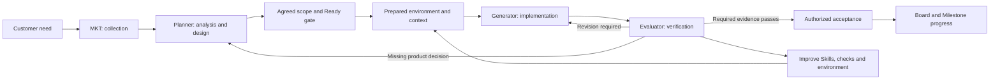

# Harness Engineering Product Direction

English | [中文](harness-engineering.zh.md)

## Summary

HuntianLing is a dsh plugin that presents a standard development board and, behind it, prepares a standard vibe-coding environment. The board is the plugin interface: users collect requirements, design requirements, and inspect project development and progress there. The environment, three Agents, and engineering methods stay in the background so customers can start work without assembling that setup. The purpose is high-quality, accepted code against the customer's vibe-coding goals. Long tasks retain decisions and progress across sessions and recover from interruption.

This page owns product direction and the assessment of alignment. [The backlog](backlog.md) owns requirement ids, acceptance criteria, status, and implementation order. [The engine design](../architecture/workflow-orchestration-engine.md) owns runtime responsibilities. The proposed capabilities below are not evidence that the runtime is implemented.

## Table of Contents

- [Original Intent](#original-intent)
- [Product Outcome](#product-outcome)
- [Three Audiences](#three-audiences)
- [MKT Collection Role](#mkt-collection-role)
- [Agent Channel](#agent-channel)
- [Skill Boundary and Depth](#skill-boundary-and-depth)
- [Visible Board and Invisible Environment](#visible-board-and-invisible-environment)
- [Built-In Planner, Generator, and Evaluator](#built-in-planner-generator-and-evaluator)
- [Engineering Methods in Executable Work](#engineering-methods-in-executable-work)
- [What the Articles Contribute](#what-the-articles-contribute)
- [Alignment Assessment](#alignment-assessment)
- [Requirement Design and Delivery](#requirement-design-and-delivery)
- [Project Information and Progress](#project-information-and-progress)
- [Developing HuntianLing with HuntianLing](#developing-huntianling-with-huntianling)
- [Self-Harness Skill Gap](#self-harness-skill-gap)
- [Measuring the Harness](#measuring-the-harness)
- [Dev Note](#dev-note)

## Original Intent

HuntianLing is one product with two faces.

The plugin interface is a standard development board. On that board the harness collects requirements, designs requirements, and shows project development and progress. The visualization is concrete: what was collected, what design was produced, what is being built, and how far delivery has come.

The invisible backend is a standard vibe-coding environment, prepared in the current dsh setup through this plugin. Customers do not assemble tools, agents, methods, and gates for each project. They connect a repository and start work. That environment implements Anthropic's Planner, Generator, and Evaluator, and integrates the engineering methods used in real development, so those agents produce high-quality code against the customer's vibe-coding goals.

The board shows that work. The environment does the work. Neither face is the product without the other.

This repository uses the same product to implement HuntianLing: the board records collection, design, and progress; the environment and three Agents, when present, execute the slice. Until the runtime exists, execution is manual or externally operated and must be labeled as such.

## Product Outcome

A customer can explain a need, review its analysis and design, authorize a bounded delivery scope, and inspect working code with acceptance evidence. The system prepares the repository environment, supplies relevant context and Skills, runs authorized work, verifies the result, and turns failures into revisions or a concrete human decision.

The board reuses familiar project-management presentation from GitHub-style repository work: linked repositories, requirements, planning, reviews, checks, and progress. Those views display harness collection, design, and delivery. Internal WorkItems own requirement hierarchy and delivery intent. Git and CI remain authoritative for their commits and execution results; adapters link those facts to WorkItems. GitHub Issues and Projects can import or project records with provenance and explicit conflict handling. Core delivery must also work with local Git and local checks.

dsh supplies the model/tool loop and host execution capabilities. HuntianLing selects project methods and policies, supplies task inputs, coordinates delivery, and records business state and evidence. Missing host capabilities should have an explicit host dependency or adapter requirement. The plugin should not silently grow a competing model runtime or sandbox platform.

## Three Audiences

The plugin provides one Web service. After login, each principal uses one of three shells. The shells project the same WorkItem records; they are not three stores (`REQ-WEB-007`).

| Audience | After login | Must not see |
| --- | --- | --- |
| Customer | Create and open only their projects; talk to MKT; see original requirements they submitted; see customer-safe progress | Other customers' projects, environment setup, Agent internals, gates, developer board controls |
| Developer | Standard development board for collection, design, and progress; Agent Channel for human and Agent messages; bind repository and environment profile to a customer project | Need not assemble the environment per project |
| Admin | Users, project membership, environment readiness, plugin configuration | Admin is not the primary editor of customer requirement text |

Customer-safe progress labels are submitted, waiting on customer, in analysis, in development, and delivered. Those labels are projections of evidence-backed state. A customer project is a business workspace; developers or admins bind Git and the environment profile to it.

Product questions, missing decisions, and acceptance prompts return to the customer MKT dialog. They do not send the customer onto the developer board.

## MKT Collection Role

MKT is the requirement-collection role (`REQ-MKT-001`). A human or an Agent may execute it. Replacement is equivalent only when inputs, Skills, tools, outputs, and sensors stay the same.

MKT talks with the customer, keeps the raw chat, and writes original requirements onto the board. It does not freeze technical design, split implementation Tasks, change code, or declare acceptance. Planner reads confirmed original requirements when design runs. Generator and Evaluator run in the invisible environment.

The first MKT Skill pack covers interview and clarification, distinguishing a wish from a trackable requirement, extracting original-requirement fields, preserving quotes, confirming before tracking, and returning product questions to the customer dialog (`REQ-MKT-002`). The customer sees their own words immediately. A record becomes a tracked original requirement only after the configured confirm path.

Existing intake sessions are the MKT collection record. Product language uses MKT; `REQ-INTAKE-*` remain the storage and API ids until renamed in a dedicated change.

## Agent Channel

MKT, Planner, Generator, Evaluator, and developers share one project Agent Channel in the developer shell (`REQ-COLLAB-001`, `REQ-COLLAB-004`). It is a chat view of typed messages. It is not the customer MKT dialog and not the dsh LLM task chat.

Every message uses one envelope and a closed `type` discriminant. Free-text notes are allowed; they do not change WorkItem state. Assignment, tracking, reporting, feedback, and handoff messages update the owning collaboration-task, WorkItem, or evidence record in the same accepted write. Hidden model-to-model talk is not a delivery record.

First-slice types cover note, task lifecycle, question, progress, report, handoff, blocker, human interrupt, and a bridge that sends product questions to the customer MKT dialog. Later types stay in the schema catalog and are not the first milestone.

## Skill Boundary and Depth

The harness does not assume a strong model. Commercial quality comes from declared Skill boundaries, selected depth, and sensors, not from a longer prompt (`REQ-SKILL-005`, `REQ-SKILL-006`, `REQ-HARNESS-008`).

A Skill is four layers. A markdown guide alone is not a Skill.

| Layer | What it holds | Weak-model use |
| --- | --- | --- |
| Guide | When to use the Skill, what it must not do, method steps | The model will not keep the role boundary unaided |
| Contract | Input and output schema, allowed tools, supported role and task types | Stops free-form prose from becoming a requirement |
| Sensors | Required fields, quote presence, validators, passing and failing examples | Catches omitted questions, invention, and self-approval |
| Depth | Which steps the model, a tool, or a human performs | Same role, more scaffolding when the model is weak |

Authority (who may push Git) stays `REQ-AGENT-004`. Skill **boundary** is competence: what the Skill covers and refuses. Skill **depth** is how much scaffolding that competence uses for the current model.

Boundary rules: load only matching Skills; missing required Skills create a gap and block the task; fields outside the schema are rejected.

Depth levels for a role capability:

| Level | Who works | Default for an unmeasured or weak model |
| --- | --- | --- |
| 0 checklist | Human follows the Skill; no model | When the model is unavailable |
| 1 form fill | Model fills the schema; tools validate; human confirms | **MKT default** |
| 2 question loop | Missing fields become questions; tools persist only when sensors pass | When required fields are often missing |
| 3 method constraint | A method's required examples or counterexamples must be present | High-risk collection only |
| 4 calibrated quality | A separate rubric scores the artifact; failure returns to questions | Only after `REQ-HARNESS-004` shows lift |

Runtime selects the lowest depth that passed calibration for this model and task, or the project policy. Repeated sensor failure lowers depth; it does not retry the same prompt without bound. Each step is model, tool, or human, not an unmarked mix. Writes of original requirements and code go through tools.

One-shot commercial quality is defined on a bounded original-requirement slice: MKT sensors pass, design is agreed when Planner runs, Generator and Evaluator run in the prepared environment, and customer progress updates from evidence. It is not defined as generating a whole product in one model call.

## Visible Board and Invisible Environment

Users meet HuntianLing as a standard development board. They should not have to look behind it to begin work. The plugin composes the environment, three Agents, methods, tools, and gates in the existing dsh host. That composition stays in the background unless something is blocked.

| Face | Product part | What HuntianLing supplies | What the user experiences |
| --- | --- | --- | --- |
| Visible | Standard development board | Requirement collection, requirement design, development status, and progress views drawn from the same records the environment produces | A standard development board where they collect and design requirements and inspect project progress |
| Invisible | Standard vibe-coding environment | Versioned dsh plugin composition, repository conventions, toolchain preparation, model/tool access, Skills, checks, preview tools, persistence, and recovery | A ready workspace after connecting a project, or a specific prerequisite to resolve |
| Invisible | Three-Agent implementation | Runnable Planner, Generator, and Evaluator definitions with inputs, tools, outputs, and handoffs | Collected needs become designs, working changes, evaluation findings, and revisions, shown on the board |
| Invisible | Engineering methods | Built-in methods connected to Agent instructions, structured artifacts, workflow transitions, and executable checks | Consistent analysis, design, implementation, review, and acceptance without prompting each step by hand |

The environment includes operating rules as well as installed software. The standard profile establishes how the repository is understood, how requirements are designed, how tasks are handed off, how changes are tested, and how failures are repaired. It composes dsh capabilities and adds the missing project behavior through plugins. The initial deployment uses the current host environment and an appropriate workspace; it does not require a new cloud platform or a container for every Agent.

Setup must inspect the existing environment, reuse compatible capabilities, prepare missing declared dependencies, and report readiness against the chosen profile. Reopening a project must preserve its work and profile version. Project-specific configuration is an explicit override of that versioned baseline. Support for one configured technology profile can ship first, but that profile must be reusable for another project without developer-specific setup knowledge.

Backend work should be unobtrusive during normal use. Users see preparation, current work, results, blockers, and decisions in product terms; detailed tool and execution evidence remains available for inspection. Hiding setup complexity does not hide a failed setup or invent progress. The first acceptance includes a fresh-project onboarding demonstration, not only a run in the maintainer's already-prepared checkout (`REQ-HARNESS-001`, `REQ-HARNESS-005`).

## Built-In Planner, Generator, and Evaluator

HuntianLing adopts the three-Agent architecture named in [Anthropic's application-development article](https://www.anthropic.com/engineering/harness-design-long-running-apps). The following inputs, outputs, and board integrations are this product's implementation requirements (`REQ-HARNESS-006`).

| Agent | Input and responsibility | Durable output and board presentation |
| --- | --- | --- |
| Planner | Reads customer dialogue, source material, repository context, constraints, and selected design methods; asks for missing information and produces requirement analysis, product design, acceptance examples, and a delivery decomposition. | Versioned proposed requirements and design, source references, assumptions, unresolved questions, and planned work, available for user review on the board. |
| Generator | Reads the accepted design and delivery scope, uses the prepared environment and implementation Skills, changes code, runs self-checks, and repairs defects reported by the Evaluator. | Change set, runnable application or artifact, self-check results, progress, blockers, and recovery information linked to the requirement. |
| Evaluator | Reads the accepted scope and actual candidate artifact independently, exercises relevant user/API/data behavior, inspects code quality, and evaluates the configured acceptance criteria. | Criterion-level results, reproducible defects, supporting evidence, and pass or revision-required decisions visible on the board. |

These are three executable Agent definitions and distinct task contexts, not only labels assigned to one generic task. Planner output stays at product intent, scenarios, assumptions, open questions, and testable acceptance. It does not freeze repository-specific implementation details; wrong technical choices in the plan cascade into Generator work. After the user confirms scope, Generator and Evaluator agree on verifiable delivery. They can use the same model provider and run sequentially. The Generator's self-check is useful input but cannot replace the Evaluator. Humans clarify goals, approve scope and consequential actions, and can intervene in any stage; human participation does not remove the three built-in Agents from the product.

The standard path is Planner design → user-confirmed scope → Generator/Evaluator agreement on verifiable delivery → Generator implementation → Evaluator verification → repair or acceptance. A requirement change returns to the Planner and versions the affected design and evidence. Missing context returns a question; failed verification returns a repair task; environment failure returns a preparation/recovery task. The system owns routing and continuation so users do not manually relay messages among Agents.

## Engineering Methods in Executable Work

Methodology must change what an Agent does and what the system accepts. Each method declares its trigger, responsible Agent, required input, versioned Skill or instructions, output artifact, validation, and failure route (`REQ-HARNESS-007`). A list of available methodologies or a free-text design field does not provide this integration.

For example, a customer's request to cancel an order becomes a Planner-produced user story with allowed and forbidden scenarios and acceptance examples. The Generator implements the accepted behavior with the configured repository conventions and tests. The Evaluator independently checks cancellation and rejection cases against the running result. Missing behavior returns to the Generator; unclear business rules return to the Planner and customer. The board shows the requirement, design, current stage, findings, and accepted progress from those same records.

The standard profile supplies a working default combination of requirement analysis, acceptance examples, design decisions, incremental implementation, code review, behavior verification, and retrospective improvement. Projects may configure User Story, BDD/example mapping, ADR, threat modeling, prioritization, and technology-specific practices. Methods vary with the project; the three-Agent product architecture remains the baseline. Built-in methods are available on first use, while method extension and replacement remain supported.

## What the Articles Contribute

These are paraphrases of the supplied originals, read on 2026-09-11. The application column is HuntianLing's design judgment, not a claim that the authors recommend this product or that their experiments prove its results.

| Original | Relevant observation | Application to HuntianLing |
| --- | --- | --- |
| Anthropic, [Scaling Managed Agents: Decoupling the brain from the hands](https://www.anthropic.com/engineering/managed-agents) | Session history, the model loop, and execution environments can evolve and recover independently; context is not the durable session. | Keep recoverable delivery state outside the active model context and disposable environment; use dsh interfaces for execution. This does not require adopting the hosted service. |
| Anthropic, [Harness design for long-running application development](https://www.anthropic.com/engineering/harness-design-long-running-apps) | Planning, generation, and external evaluation expose different failures. The planner should expand product scope without freezing implementation details. Later experiments remove scaffolding as models improve; evaluation itself needs calibration. | Agree on testable scope, exercise real behavior, and return failures to implementation. Keep Planner at product intent. Choose review depth by risk and evidence; do not mandate fixed sprints, resets, or a large agent team. |
| Mitchell Hashimoto, [My AI Adoption Journey](https://mitchellh.com/writing/my-ai-adoption-journey) | Bounded tasks and fast verification help agents; repeated mistakes motivate better instructions and programmed tools. | Turn recurring failures into tested changes to Skills, checks, context, or environment preparation. Agent activity is useful only when it advances useful work. |
| Birgitta Böckeler, [Harness Engineering – first thoughts](https://martinfowler.com/articles/exploring-gen-ai/harness-engineering-memo.html), on Martin Fowler's site | The memo groups context, architectural constraints, and maintenance, and highlights the need to verify functionality. | Couple maintainability checks with customer acceptance; reserve human judgment for consequential decisions and unclear product intent. |
| LangChain, [The Anatomy of an Agent Harness](https://www.langchain.com/blog/the-anatomy-of-an-agent-harness) | State, tools, environments, context management, planning, and feedback make model capabilities usable for sustained work. | Derive each platform feature from a delivery behavior or failure it enables or prevents; load task-relevant capabilities and retain durable artifacts. |

The shared lesson is an engineering feedback loop. More roles, workflow nodes, documents, or execution time do not establish higher quality. Whether a particular mechanism earns its cost must be measured on our own tasks.

## Alignment Assessment

The board is the plugin interface, not an accessory to the environment. The incomplete half is the invisible backend: a reusable vibe-coding environment prepared by this dsh plugin, running Planner, Generator, and Evaluator with built-in methods, and writing collection, design, and progress onto that board.

A board that only stores fields is not yet that interface. An environment that customers cannot see through the board is not yet this product. Workflow designers, extension catalogs, a full agile role roster, regional OAuth, and certification dashboards remain later options; they are neither the standard board nor the standard environment.

| Layer | Verdict |
| --- | --- |
| Intent | One product: visible standard development board plus invisible standard vibe-coding environment with three Agents and methods. |
| Remaining gap | The board UI exists; the environment and three Agents do not yet write collection, design, and live development progress onto it. |
| Requirement inventory | Keep later catalog items visible. Do not treat them as the standard board or the standard environment. |
| Current implementation | Board, intake, requirement fields, and Web APIs exist. Environment preparation, Agent execution, and method Skills do not. Completing those backends is what makes the board the intended plugin interface. |

The first product milestone ships both faces together. Board views of collection, design, and progress are in scope when they display records from the environment and Agents. Expanding the board into a general project-management platform is not. This assessment uses the current working tree, which contains uncommitted implementation work; it is not a released-product certification.

| Area | Assessment | Decision and requirement owner |
| --- | --- | --- |
| WorkItem hierarchy, analysis/design, acceptance, Milestones | Aligned: these preserve customer intent and make large work understandable. | Keep and connect them to executable inputs: `REQ-REQ-001`, `REQ-BOARD-004`, `REQ-MILESTONE-002`. |
| Board, queue, Runs, evidence | The plugin interface. Persisted summaries are not harness collection, design, or live progress until the environment and three Agents write those records. | Wire a real Story delivery run onto the board: `REQ-FLOW-020`, `REQ-AGENT-002`. |
| Workflow designer, catalogs, extension packs, complete agile role roster | Later catalog, not the standard board or the standard environment. | Keep the board as the plugin interface and implement the environment and three Agents behind it (`REQ-HARNESS-001`, `REQ-HARNESS-006`, `REQ-HARNESS-007`); extend specialist roles and authoring tools when needed: `REQ-FLOW-001`, `REQ-FLOW-006`–`011`, `REQ-AGENT-001`. |
| Multiple databases, regional OAuth, certification dashboards | Valuable for particular deployments; they are not all prerequisites for a local delivery demonstration. | Add storage durability and access controls needed by the current deployment; defer provider breadth and control packs: `REQ-DATA-001`, `REQ-AUTH-001`–`004`, `REQ-GOV-001`–`002`. |
| Environment preparation and long-task continuity | Existing tool and scheduling requirements leave recovery and environment acceptance insufficiently explicit. | Add `REQ-HARNESS-001`–`002` and validate preparation, interruption, and reconciliation. |
| Verification, learning, and self-use | Existing gates and reviews need an explicit mechanism for evidence freshness, evaluator calibration, and learning from failed delivery. | Add `REQ-HARNESS-003`–`005`; measure accepted outcomes. |

The code supports this distinction: [the workflow module](../../src/host/agile/workflow.ts) is a stub; [the Web server](../../src/host/web/server.ts) serves workflow summaries and recomputes Story queues; [the Board Store](../../src/host/board/store.ts) persists those summaries and delivery evidence. [Focused board tests](../../test/unit/board-store.test.mjs) cover those behaviors. None alone demonstrates a model producing, repairing, and delivering code across interruption.

Scope discipline means shipping both faces of the product and deferring catalog breadth that does not feed the board or the environment. Every proposed feature should identify the customer decision, agent capability, verification signal, or recovery failure that makes it necessary.

## Requirement Design and Delivery

Requirement design is the bridge from an informal request to executable work. A card should hold the original need and source references, actors and scenarios, expected outcome, scope and non-goals, constraints, design decisions, risks, unresolved questions, and acceptance examples. Method packs should help produce those artifacts; projects select a suitable method without running every listed methodology for every task.

Before implementation, the owner and reviewer agree on a versioned delivery scope: requirement and design revision, included acceptance criteria, repository and baseline, expected outputs, verification approach, permissions, and budget. This is a delivery contract because completion depends on those obligations. Product ambiguity returns to clarification; it must not be silently filled by an ambitious planner or expanded by the builder.

The standard coding workflow runs the built-in Planner, Generator, and Evaluator. Project risk selects the methods and depth of evaluation; it does not silently substitute the Generator's self-check or a human task for the Evaluator. Human decisions supplement the automated workflow. Tests, model evaluation, and human acceptance each retain their own evidence.

Acceptance must first prove that another project can use the standard setup without maintainer-specific preparation, then cover one real HuntianLing Story with the same profile and three Agents: prepare its environment, implement it through dsh, detect an actual or deliberately introduced defect, revise it, resume after an interruption, and accept it against evidence from the resulting revision. Failure and recovery demonstrations belong in isolated development runs. A green board card alone does not pass this demonstration.

## Project Information and Progress

The plugin interface is the standard development board. It visualizes harness requirement collection, requirement design, project development, and progress. The interface should answer what was collected, why this design was chosen, what is being built, what has been accepted, what is still missing, who or which agent owns the next action, and what decision would unblock progress.

Planning progress, execution activity, and verified delivery must remain distinct. A running agent, completed Task, filled design field, successful PR merge, or passing build cannot individually establish customer acceptance. Rollups should show accepted criteria against the agreed scope, outstanding required children or slices, blockers, and the revision and evidence behind each acceptance. If scope changes, display the changed denominator and identify the evidence that needs revalidation.

Runs should show durable state, next action, tool/environment failures, wait reasons, recovery points, and cost. Team Chat is a readable collaboration projection; consequential decisions and handoffs must also update the owning records. A runtime summary entered manually should be labeled as such until real execution events support it.

## Developing HuntianLing with HuntianLing

The same method applies to this repository immediately, with automation coverage stated honestly. Product requirements are authored in the bilingual backlog. Development WorkItems reference those `REQ-*` ids and keep their execution state, acceptance evidence, and ownership on the board when available. This separates specification ownership from execution records without creating competing copies of the requirement text.

Until runtime automation exists, a developer or an externally operated agent performs the steps and links the actual artifacts. A repository review record can hold evidence when the board cannot yet represent it. Record who performed each step and mark it as manual, external-agent, or HuntianLing-runtime execution. Do not claim a self-hosted automated delivery run from a manually edited summary.

| Step | Required working record | Exit evidence |
| --- | --- | --- |
| Select | `REQ-*`, one bounded Story or slice, owner, Milestone when relevant, scope and open questions | Customer outcome and acceptance examples are reviewable. |
| Design | Analysis/design revision, chosen method, relevant Skills, dependencies and risks | Reviewer agrees that the proposed behavior satisfies the need. |
| Prepare | Repository revision, environment profile, runnable checks, permissions and budget | Preparation and a baseline check have observed results; missing capability blocks execution visibly. |
| Implement | Branch or change set, task/session references, progress and recovery note | A reviewable change and focused verification output exist. |
| Evaluate | Reviewer identity, criterion results, defects and source revision | Required behavior is exercised; failed criteria return to implementation. |
| Accept | Current code/design revisions, check artifacts, review decision and authorized exceptions | All applicable gates pass; partial evidence leaves the slice incomplete. |
| Improve | Recurring failure, proposed harness change and regression example | A measured improvement to the harness is retained, or an ineffective rule is removed. |

Unavailable repository gates remain visible blockers for the stage that requires them. For example, a lint script that exits with a probe failure is not passing lint. A documentation review may complete its scoped checks without certifying a code release. This review records direction and requirements; the first runtime demonstration remains planned under `REQ-HARNESS-005`.

## Self-Harness Skill Gap

HuntianLing is being built with local agent Skills and `AGENTS.md`, not yet with the product harness. Those Skills do not match the research articles or this page's four-layer Skill (guide, contract, sensors, depth).

Host-repo guides still exist: `dsh-doc`, `dsh-prose-standard`, `dsh-trim-cot-leakage`, `dsh-code-review`, `dsh-pre-push-checks`, `dsh-ci-test-reliability`, `dsh-translate-docs`, `dsh-archive-agent-notes`, `dsh-find-simplifications`, `dsh-merging-stacked-prs`, `record-browser-gif`. They remain Markdown-only.

Self-development at depth 0–1 now lives in `.agents/skills/huntianling-self-harness/` with role Skills `huntianling-mkt`, `huntianling-planner`, `huntianling-environment`, `huntianling-generator`, and `huntianling-evaluator`. Those packs have output contracts and a validator (`pnpm run self-harness:validate`). They are not the product runtime. Lint and hygiene still exit as probes.

| Harness capability | In the articles / this product | In this repository today | Gap |
| --- | --- | --- | --- |
| Environment profile | Prepare, reuse, baseline check, ready or blocked | `.agents/skills/huntianling-environment`; lint/hygiene stay blocked | No product `REQ-HARNESS-001` profile runtime |
| Durable delivery state | Session outside context; checkpoints | JSON board + host sessions | No interrupt/resume Skill |
| MKT | Collect original requirements with quotes | Intake UI plus `.agents/skills/huntianling-mkt` | Depth 0–1 only; not product MKT runtime |
| Planner | Product intent and testable acceptance, not frozen implementation | `.agents/skills/huntianling-planner` | Depth 0–1 only; not product Planner runtime |
| Generator | Implement in the prepared environment; self-check is not acceptance | `.agents/skills/huntianling-generator` | Depth 0–1 only; forbids self-acceptance |
| Evaluator | Independent behavior checks | `.agents/skills/huntianling-evaluator` plus tests | Depth 0–1; still a separate pass, not a runtime Agent |
| Skill boundary and depth | Covers/refuses, depth 0–4, downgrade on failure | Self-harness validator for slice JSON | Product Skill registry still missing |
| Sensors / gates | Tools and checks that fail the slice | `typecheck`, `test`, `doc-sync`; lint/hygiene fail | Incomplete; probe failures are not passing gates |
| Failure to harness change | One change, measured, then keep or remove | Informal | No `REQ-HARNESS-004` loop |
| Agent Channel | Typed handoffs | None | `REQ-COLLAB-004` missing |
| Three shells | Customer / developer / admin | One fused page | `REQ-WEB-007` missing |

Treat this repository as **depth 0–1** using `.agents/skills/huntianling-self-harness/`. Label executors as manual or external-agent. Do not claim HuntianLing-runtime MKT, Planner, Generator, or Evaluator. Product Phase B still has to ship audience shells, the environment profile runtime, and the three Agents. Then `REQ-HARNESS-005`.

## Measuring the Harness

`REQ-HARNESS-004` owns evaluation acceptance. Use representative requirement-design and coding tasks with fixed inputs, baseline revisions, acceptance criteria, model settings, and declared budgets. Compare a baseline process with one changed harness mechanism at a time, including one Skill depth level. Keep failed and cancelled runs in the results and repeat model-dependent trials; deterministic replay only verifies the recorded orchestration behavior.

A depth level becomes required only after that comparison. Track accepted-scope completion on bounded original-requirement slices, escaped defects, repair rounds, human intervention time, recovery success, elapsed time, and token/tool cost with artifact references. Report verification coverage and unavailable evidence alongside the result. No target percentage or quality improvement is established yet. Expand roles, parallelism, review depth, or platform services when those measurements or a concrete customer constraint justify them.

## Dev Note

None.
