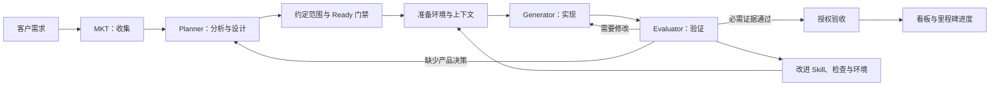

# Harness Engineering 产品定位

[English](harness-engineering.md) | 中文

## 摘要

HuntianLing 是一个 dsh 插件：界面是标准开发看板，背后准备标准 vibe coding 环境。看板是插件界面，用户在上面收集需求、设计需求、查看项目开发和进度。环境、三个 Agent 和工程方法留在后台，客户不必自行拼装即可开始工作。目的是针对客户的 vibe coding 目标产出高质量、通过验收的代码。长任务跨会话保留决策与进度，并能从中断恢复。

本页负责产品定位和方向审视。[需求 backlog](backlog.zh.md) 负责需求编号、验收标准、状态和实现顺序。[引擎设计](../architecture/workflow-orchestration-engine.zh.md) 负责运行时职责。下文提出的能力不代表运行时已经实现。

## 目录

- [原始意图](#原始意图)
- [产品结果](#产品结果)
- [三种人群](#三种人群)
- [MKT 收集角色](#mkt-收集角色)
- [Agent 频道](#agent-频道)
- [Skill 能力边界与深度](#skill-能力边界与深度)
- [可见看板与不可见环境](#可见看板与不可见环境)
- [内置 Planner、Generator 和 Evaluator](#内置-plannergenerator-和-evaluator)
- [把工程方法落实到执行](#把工程方法落实到执行)
- [原文提供的启发](#原文提供的启发)
- [方向审视](#方向审视)
- [需求设计与交付](#需求设计与交付)
- [项目信息与进度](#项目信息与进度)
- [用同一方法开发 HuntianLing](#用同一方法开发-huntianling)
- [自身 Harness 的 Skill 短板](#自身-harness-的-skill-短板)
- [衡量 Harness 的效果](#衡量-harness-的效果)
- [开发备注](#开发备注)

## 原始意图

HuntianLing 是一体两面的同一个产品。

插件界面是标准开发看板。看板上由 harness 收集需求、设计需求，并展示项目开发和进度。可视化是具体的：收集了什么、形成了什么设计、正在构建什么、交付到了哪一步。

不可见的后端是标准 vibe coding 环境，由本插件在当前 dsh 中准备。客户不必为每个项目自行拼装工具、Agent、方法和门禁，接入仓库即可开始工作。该环境实现 Anthropic 的 Planner、Generator、Evaluator，并把实际开发要用的工程方法集成进去，使这些 Agent 针对客户的 vibe coding 目标产出高质量代码。

看板展示这些工作。环境执行这些工作。缺少任何一面都不是这个产品。

本仓库用同一产品实现 HuntianLing：看板记录收集、设计和进度；环境和三个 Agent 就绪后执行切片。运行时尚未存在时，执行由人工或外部操作的 Agent 完成，必须如实标注。

## 产品结果

客户可以表达需求、审阅分析和设计、授权一个有明确范围的交付任务，并查看可运行的代码及验收证据。系统准备仓库环境、提供相关上下文和 Skill、执行已授权工作、验证结果，并把失败转化为修改任务或具体的人工决策。

看板沿用 GitHub 式仓库工作中大家熟悉的项目管理呈现：关联仓库、需求、规划、评审、检查和进度。这些视图展示 harness 的收集、设计和交付。内部 WorkItem 拥有需求层级和交付意图；Git 和 CI 仍是提交与执行结果的事实源，适配器把这些事实关联到 WorkItem。GitHub Issues 和 Projects 可以导入或投影记录，并保留来源、显式处理冲突。核心交付也必须支持本地 Git 和本地检查。

dsh 提供模型与工具循环以及宿主执行能力。HuntianLing 选择项目方法和策略、提供任务输入、协调交付，并记录业务状态和证据。缺失的宿主能力应形成明确的宿主依赖或适配器需求，插件不应在不知不觉中再造一套模型运行时或沙箱平台。

## 三种人群

插件提供一套 Web 服务。登录后每个主体使用三种界面之一。三种界面投影同一组 WorkItem 记录，不是三套存储（`REQ-WEB-007`）。

| 人群 | 登录后 | 不得看到 |
| --- | --- | --- |
| 客户 | 只创建和打开自己的项目；与 MKT 对话；查看自己提交的原始需求；查看客户侧进度 | 其他客户的项目、环境搭建、Agent 内部、门禁、开发看板控件 |
| 开发 | 标准开发看板，用于收集、设计和进度；Agent 频道用于人与 Agent 消息；把仓库和环境配置绑到客户项目 | 不必为每个项目自行拼装环境 |
| 管理员 | 用户、项目归属、环境是否就绪、插件配置 | 管理员不是客户需求正文的主编辑界面 |

客户侧进度标签为：已提出、待客户确认、分析中、开发中、已交付。这些标签是有证据状态的投影。客户项目是业务工作区；由开发或管理员把 Git 和环境配置绑上去。

产品问题、缺失决策和验收提示回到客户的 MKT 对话框，不把客户赶到开发看板。

## MKT 收集角色

MKT 是需求收集角色（`REQ-MKT-001`）。人与 Agent 都可以执行。只有输入、Skill、工具、输出和传感器保持不变时，替换才算等价。

MKT 与客户对话，保留原始聊天，并把原始需求写到看板。它不冻结技术方案、不拆实现 Task、不改代码、不宣布验收。Planner 在开展设计时读取已确认的原始需求。Generator 和 Evaluator 在不可见环境中运行。

第一包 MKT Skill 覆盖追问与澄清、区分愿望与可跟踪需求、抽出原始需求字段、保留原话、确认后才跟踪，以及把产品问题送回客户对话框（`REQ-MKT-002`）。客户能立刻看到自己的原话。只有经过配置的确认路径后，记录才成为跟踪中的原始需求。

现有 intake 会话就是 MKT 的收集记录。产品语言使用 MKT；`REQ-INTAKE-*` 在专门重命名之前仍是存储和 API 编号。

## Agent 频道

MKT、Planner、Generator、Evaluator 和开发者在开发界面共享一个项目 Agent 频道（`REQ-COLLAB-001`、`REQ-COLLAB-004`）。它是类型化消息的聊天视图。它不是客户的 MKT 对话框，也不是 dsh 的 LLM 任务聊天。

每条消息使用同一信封和封闭的 `type` 判别字段。允许自由文本备注，它们不改变 WorkItem 状态。分配、跟踪、报告、反馈和交接消息必须在同一次被接受的写入中更新所属的协作任务、WorkItem 或证据记录。模型之间的隐藏对话不是交付记录。

首个切片类型覆盖备注、任务生命周期、提问、进度、报告、交接、阻塞、人工打断，以及把产品问题送到客户 MKT 对话框的桥接。后续类型留在 schema 目录中，不属于首个里程碑。

## Skill 能力边界与深度

Harness 不假设模型很强。商业质量来自声明的 Skill 边界、选定的深度和传感器，而不是更长的提示词（`REQ-SKILL-005`、`REQ-SKILL-006`、`REQ-HARNESS-008`）。

一个 Skill 有四层。只有 Markdown 指南不算 Skill。

| 层 | 保存什么 | 弱模型时的用途 |
| --- | --- | --- |
| 指南 | 何时使用、不准做什么、方法步骤 | 模型无法独自守住角色边界 |
| 契约 | 输入输出 schema、允许的工具、支持的角色和任务类型 | 阻止自由散文变成需求 |
| 传感器 | 必填项、原话、校验器、通过与失败示例 | 抓住漏问、编造和自我批准 |
| 深度 | 每一步由模型、工具还是人执行 | 同一角色，模型弱时脚手架更深 |

权限（谁可以 push Git）仍由 `REQ-AGENT-004` 负责。Skill **边界**是能力范围：覆盖什么、拒绝什么。Skill **深度**是当前模型下用多少脚手架。

边界规则：只加载匹配的 Skill；缺少必需 Skill 时记缺口并拦住任务；schema 之外的字段被拒绝。

角色能力的深度档：

| 档 | 谁干活 | 未测评或弱模型的默认 |
| --- | --- | --- |
| 0 清单 | 人按 Skill 执行，不用模型 | 模型不可用时 |
| 1 填表 | 模型按 schema 填写，工具校验，人确认 | **MKT 默认** |
| 2 追问环 | 缺字段就提问，传感器通过后工具才落盘 | 必填项经常缺失时 |
| 3 方法约束 | 方法要求的正例或反例必须具备 | 仅高风险收集 |
| 4 校准质检 | 另一套准则给产物打分，失败则再问 | 仅在 `REQ-HARNESS-004` 证明有效后 |

运行时选择该模型与任务已通过校准的最低档，或项目策略。传感器反复失败则降档，不对同一提示词无界重试。每一步是模型、工具或人，不是未标明的混合。原始需求和代码的写入走工具。

一次打穿的商业质量定义在一条有边界的原始需求切片上：MKT 传感器通过，Planner 运行时设计已约定，Generator 和 Evaluator 在准备好的环境中执行，客户进度由证据更新。它不是一次模型调用生成整个产品。

## 可见看板与不可见环境

用户接触 HuntianLing 时看到的是标准开发看板，不必先去查看后台才能开始工作。插件在现有 dsh 宿主中组合环境、三个 Agent、方法、工具和门禁。除非出现阻塞，这套组合留在后台。

| 一面 | 产品组成 | HuntianLing 提供什么 | 用户得到什么体验 |
| --- | --- | --- | --- |
| 可见 | 标准开发看板 | 从环境产生的同一组记录形成需求收集、需求设计、开发状态和进度视图 | 在标准开发看板上收集和设计需求，并查看项目进度 |
| 不可见 | 标准 vibe coding 环境 | 有版本的 dsh 插件组合、仓库规范、工具链准备、模型/工具访问、Skill、检查、预览工具、持久化和恢复 | 接入项目后即可使用的工作区，或需要解决的具体前提 |
| 不可见 | 三个 Agent 的实现 | 可运行的 Planner、Generator、Evaluator 定义，分别具备输入、工具、输出和交接 | 收集到的需求形成设计、可运行变更、评价结果和修改，并在看板上展示 |
| 不可见 | 工程方法 | 将内置方法连接到 Agent 指令、结构化产物、工作流流转和可执行检查 | 一致的分析、设计、实现、评审和验收，无需逐步人工编写提示词 |

环境既包含安装的软件，也包含工作的规则。标准配置明确怎样理解仓库、怎样设计需求、怎样交接任务、怎样测试变更，以及怎样修复失败。它组合 dsh 的能力，并通过插件补足项目行为。初始部署使用当前宿主环境和合适的工作区，不要求另建云平台，也不要求每个 Agent 都有一个容器。

准备过程必须检查现有环境、复用兼容能力、准备声明中缺少的依赖，并按照所选配置报告就绪情况。重新打开项目时保留已有工作和配置版本。项目定制是对有版本基线的显式覆盖。可以先支持一种技术配置，但该配置必须能用于另一个项目，不依赖开发者私有的准备经验。

后台工作在正常使用时应尽量无感。用户看到用产品语言表达的准备情况、当前工作、结果、阻塞和决策，需要时可以深入检查工具与执行证据。隐藏搭建复杂度不代表隐藏准备失败或编造进度。首轮验收包含全新项目的接入演示，不能只在维护者已经准备好的仓库里跑通一次（`REQ-HARNESS-001`、`REQ-HARNESS-005`）。

## 内置 Planner、Generator 和 Evaluator

HuntianLing 采用 [Anthropic 应用开发原文](https://www.anthropic.com/engineering/harness-design-long-running-apps) 中命名的三个 Agent 架构。以下输入、输出和看板集成属于本产品的实现要求（`REQ-HARNESS-006`）。

| Agent | 输入与职责 | 持久产物及看板呈现 |
| --- | --- | --- |
| Planner | 读取客户对话、源材料、仓库上下文、约束和所选设计方法；追问缺失信息，形成需求分析、产品设计、验收示例和交付拆分。 | 有版本的需求与设计草案、来源引用、假设、未决问题和计划工作，供用户在看板审阅。 |
| Generator | 读取已接受设计和交付范围，使用准备好的环境与实现 Skill 修改代码、执行自检，并修复 Evaluator 报告的缺陷。 | 关联需求的变更集、可运行应用或产物、自检结果、进展、阻塞和恢复信息。 |
| Evaluator | 独立读取已接受范围和实际候选产物，验证相关用户/API/数据行为、检查代码质量，并评价配置的验收标准。 | 逐条标准结果、可复现缺陷、支持证据，以及看板可见的通过或需修改决定。 |

这是三个可执行的 Agent 定义和各自独立的任务上下文，不只是给一个通用任务贴上三个标签。Planner 的输出停留在产品意图、场景、假设、未决问题和可测试验收，不冻结仓库特有的实现细节；计划中的错误技术选择会传导到 Generator。用户确认范围后，由 Generator 与 Evaluator 约定可验证交付。它们可以使用相同模型提供商，也可以顺序运行。Generator 的自检是有用输入，但不能替代 Evaluator。人负责澄清目标、批准范围和重要操作，并可干预任意阶段；人工参与不意味着从产品中移除三个内置 Agent。

标准路径是 Planner 设计 → 用户确认范围 → Generator/Evaluator 约定可验证交付 → Generator 实现 → Evaluator 验证 → 修复或验收。需求变化返回 Planner，并为受影响设计和证据记录版本。缺少上下文返回问题，验证失败返回修复任务，环境失败返回准备/恢复任务。系统负责路由和继续执行，用户无需人工在三个 Agent 之间转述消息。

## 把工程方法落实到执行

方法论必须改变 Agent 的工作和系统接受结果的条件。每种方法声明触发条件、负责 Agent、必需输入、有版本的 Skill 或指令、输出产物、验证规则和失败去向（`REQ-HARNESS-007`）。只列出方法论名称或提供自由文本设计字段，不等于完成这种集成。

例如，客户提出取消订单，Planner 将其形成包含允许与禁止场景、验收示例的用户故事。Generator 按配置的仓库规范和测试要求实现已接受行为。Evaluator 对实际运行结果独立检查取消成功及应拒绝的情况。行为缺失返回 Generator，业务规则不清返回 Planner 和客户。看板从同一组记录展示需求、设计、当前阶段、发现的问题和已验收进度。

标准配置提供可以直接工作的默认组合：需求分析、验收示例、设计决策、增量实现、代码评审、行为验证和复盘改进。项目可以配置 User Story、BDD/实例映射、ADR、威胁建模、优先级方法和技术实践。方法随项目变化，三个 Agent 的产品架构保持为基线。内置方法首次使用即可用，同时保留方法扩展与替换能力。

## 原文提供的启发

下表是对所提供原文的转述，阅读日期为 2026-09-11。“应用”列属于 HuntianLing 的设计判断，不表示作者推荐本产品，也不表示其试验已经证明本项目的效果。

| 原文 | 相关观察 | 对 HuntianLing 的应用 |
| --- | --- | --- |
| Anthropic，[Scaling Managed Agents: Decoupling the brain from the hands](https://www.anthropic.com/engineering/managed-agents) | 会话历史、模型循环和执行环境可以独立演进与恢复；上下文不等于持久化会话。 | 把可恢复的交付状态放在活跃模型上下文和可丢弃环境之外，通过 dsh 接口执行。这不要求采用其托管服务。 |
| Anthropic，[Harness design for long-running application development](https://www.anthropic.com/engineering/harness-design-long-running-apps) | 规划、生成和外部评价发现不同问题。Planner 应扩展产品范围，但不冻结实现细节。后续试验随着模型进步移除辅助结构，评价器自身也需要校准。 | 先约定可测试范围，实际操作功能，把失败返回实现阶段。Planner 保持在产品意图层。按风险和证据选择评审深度，不强制固定 Sprint、上下文重置或庞大的 Agent 团队。 |
| Mitchell Hashimoto，[My AI Adoption Journey](https://mitchellh.com/writing/my-ai-adoption-journey) | 有明确范围的任务与快速验证有助于 Agent；重复错误推动指令和程序化工具改进。 | 把重复失败转化为经过测试的 Skill、检查、上下文或环境准备改进。只有推进有用工作的 Agent 活动才有价值。 |
| Birgitta Böckeler，发表于 Martin Fowler 网站的 [Harness Engineering – first thoughts](https://martinfowler.com/articles/exploring-gen-ai/harness-engineering-memo.html) | 文章归纳了上下文、架构约束和维护，并指出功能验证的必要性。 | 将可维护性检查与客户验收结合，把人的判断用于重要决策和不明确的产品意图。 |
| LangChain，[The Anatomy of an Agent Harness](https://www.langchain.com/blog/the-anatomy-of-an-agent-harness) | 状态、工具、环境、上下文管理、规划和反馈让模型能力可以用于持续工作。 | 从要实现的交付行为或要解决的失败出发推导平台功能，按任务加载相关能力并持久保存产物。 |

共同启发是建立工程反馈闭环。角色、工作流节点、文档或执行时间的增加，都不能证明质量提高。某个机制是否值得其成本，需要在我们自己的任务上衡量。

## 方向审视

看板是插件界面，不是环境的附属入口。尚未补齐的是不可见的后端：由本 dsh 插件准备的可复用 vibe coding 环境，运行 Planner、Generator、Evaluator 和内置方法，并把收集、设计和进度写到看板上。

只保存字段的看板还不是这个界面。客户无法通过看板看到的环境也还不是这个产品。工作流设计器、扩展目录、完整敏捷角色名单、区域 OAuth 和认证仪表盘仍是后续选项，它们既不是标准看板，也不是标准环境。

| 层次 | 判断 |
| --- | --- |
| 意图 | 同一个产品：可见的标准开发看板，加上不可见的标准 vibe coding 环境、三个 Agent 和方法。 |
| 剩余缺口 | 看板界面已经存在；环境和三个 Agent 尚未把收集、设计和实际开发进度写到看板上。 |
| 需求清单 | 后续目录条目保持可见，但不作为标准看板或标准环境。 |
| 当前实现 | 已有看板、录入、需求字段和 Web API。环境准备、Agent 执行和方法 Skill 尚未实现。补上这些后端，看板才会成为预期的插件界面。 |

首个产品里程碑同时交付这两面。展示收集、设计和进度的看板视图，在读取环境和 Agent 记录时属于范围内。把看板扩展成通用项目管理平台不属于范围。本次审视基于包含未提交实现工作的当前工作区，不是已发布产品的能力认证。

| 领域 | 判断 | 决策与对应需求 |
| --- | --- | --- |
| WorkItem 层级、分析与设计、验收、Milestone | 方向一致：保留客户意图，让大任务可以理解。 | 保留并连接可执行输入：`REQ-REQ-001`、`REQ-BOARD-004`、`REQ-MILESTONE-002`。 |
| 看板、队列、Runs、证据 | 这是插件界面。持久化摘要还不是 harness 的收集、设计和实际进度，除非环境和三个 Agent 把这些记录写上去。 | 把真实 Story 交付运行接到看板上：`REQ-FLOW-020`、`REQ-AGENT-002`。 |
| 工作流设计器、目录、扩展包、完整敏捷角色名单 | 后续目录，不是标准看板或标准环境。 | 看板作为插件界面，环境和三个 Agent 做在它后面（`REQ-HARNESS-001`、`REQ-HARNESS-006`、`REQ-HARNESS-007`）；按需要扩展专业角色和编写工具：`REQ-FLOW-001`、`REQ-FLOW-006`–`011`、`REQ-AGENT-001`。 |
| 多数据库、区域 OAuth、认证治理仪表盘 | 对特定部署有价值，但并非本地交付演示的全部前提。 | 补足当前部署所需的存储持久性和访问控制，推迟提供商广度与控制包：`REQ-DATA-001`、`REQ-AUTH-001`–`004`、`REQ-GOV-001`–`002`。 |
| 环境准备与长任务连续性 | 现有工具和调度需求没有充分明确恢复与环境验收。 | 新增 `REQ-HARNESS-001`–`002`，验证准备、中断和状态核对。 |
| 验证、改进与自身实践 | 现有门禁和评审需要明确证据时效、评价器校准及从交付失败中学习的机制。 | 新增 `REQ-HARNESS-003`–`005`，衡量通过验收的结果。 |

代码支持上述区分：[工作流模块](../../src/host/agile/workflow.ts) 仍是占位实现；[Web 服务](../../src/host/web/server.ts) 提供工作流摘要和 Story 队列重算；[Board Store](../../src/host/board/store.ts) 持久化这些摘要及交付证据。[聚焦的看板测试](../../test/unit/board-store.test.mjs) 覆盖这些行为。单凭这些能力，无法证明模型能够跨中断生成、修复并交付代码。

范围控制意味着交付产品的两面，并推迟不能服务看板或环境的目录广度。每项新增功能都应说明它支持哪个客户决策、Agent 能力、验证信号或恢复场景。

## 需求设计与交付

需求设计是从非正式表达走向可执行工作的桥梁。卡片应保存原始需求和来源、角色和场景、预期结果、范围与非目标、约束、设计决策、风险、未决问题和验收示例。方法包应帮助产生这些产物；项目选择合适的方法，无需为每个任务运行列出的所有方法论。

实现前，负责人和评审者约定有版本的交付范围：需求与设计版本、包含的验收标准、仓库与基线、预期产物、验证方法、权限和预算。这是一份交付契约，因为完成取决于这些义务。产品歧义必须回到澄清，不能由激进的规划者默默填补，也不能由实现者擅自扩展。

标准编码流程运行内置 Planner、Generator 和 Evaluator。项目风险决定方法与评价深度，不会默默用 Generator 自检或人工任务替代 Evaluator。人工决策补充自动化工作流。测试、模型评价和人工验收分别保留自身证据。

验收必须先证明另一个项目无需维护者私有准备即可使用标准环境，再用相同配置和三个 Agent 覆盖 HuntianLing 自身的一个真实 Story：准备环境，通过 dsh 实现，发现实际存在或刻意注入的缺陷，修改，中断后恢复，并依据最终版本的证据完成验收。失败与恢复演示应在隔离的开发运行中开展。仅有一张变绿的看板卡片不能通过这项演示。

## 项目信息与进度

插件界面是标准开发看板。它可视化 harness 的需求收集、需求设计、项目开发和进度。界面应回答收集了什么、为何选择这个设计、正在构建什么、哪些内容已通过验收、还缺什么、下一步由谁或哪个 Agent 负责，以及哪个决策能够解除阻塞。

规划进度、执行活动和已验证交付必须区分。Agent 正在运行、Task 完成、设计字段已填写、PR 合并成功或构建通过，均不能单独证明客户验收。汇总应显示已约定范围内通过验收的标准、未完成的必需子项或切片、阻塞，以及每次验收对应的版本与证据。范围变化时，要显示分母变化并指出哪些证据需要重新验证。

Runs 应显示持久状态、下一步、工具或环境失败、等待原因、恢复点和成本。Team Chat 是便于阅读的协作投影；重要决策和交接还必须更新相应记录。手工填写的运行摘要应明确标识，直到有真实执行事件支撑。

## 用同一方法开发 HuntianLing

同一方法立即适用于本仓库，但必须如实说明自动化覆盖范围。产品需求在双语 backlog 中编写；开发 WorkItem 引用对应 `REQ-*` 编号，并在看板可用时保存执行状态、验收证据和负责人。这区分了规格归属与执行记录，不复制出相互竞争的需求正文。

运行时自动化尚未实现时，由开发者或外部操作的 Agent 执行步骤，并关联实际产物。看板尚不能表示的证据可保存在仓库评审记录中。记录每步的执行者，并标为人工、外部 Agent 或 HuntianLing 运行时执行。不能通过手工编辑摘要就宣称已经完成系统自身驱动的自动交付。

| 步骤 | 必需工作记录 | 出口证据 |
| --- | --- | --- |
| 选择 | `REQ-*`、一个范围明确的 Story 或切片、负责人、适用的 Milestone、范围和未决问题 | 客户结果和验收示例可以审阅。 |
| 设计 | 分析与设计版本、所选方法、相关 Skill、依赖和风险 | 评审者认可提出的行为能够满足需求。 |
| 准备 | 仓库版本、环境配置、可执行检查、权限和预算 | 环境准备和基线检查有实际结果；能力缺失时明确阻止执行。 |
| 实现 | 分支或变更集、任务与会话引用、进度和恢复说明 | 有可审阅变更和聚焦验证输出。 |
| 评价 | 评审者身份、逐项验收结果、缺陷和源代码版本 | 实际验证必需行为；失败标准返回实现阶段。 |
| 验收 | 当前代码与设计版本、检查产物、评审决定和已授权例外 | 所有适用门禁通过；证据不全时切片保持未完成。 |
| 改进 | 重复失败、拟议 Harness 改进和回归示例 | 保留有实测效果的 Harness 改进，或移除无效规则。 |

仓库门禁不可用时，对要求该门禁的阶段仍须显示阻塞。例如以 probe 失败退出的 lint 脚本不等于 lint 通过。文档审视可以完成其范围内的检查，但不能据此认证代码发布。本次审视记录定位和需求，首次运行时演示仍在 `REQ-HARNESS-005` 下规划。

## 自身 Harness 的 Skill 短板

HuntianLing 目前用本地 Agent Skill 和 `AGENTS.md` 开发，还不是用产品 harness。这些 Skill 对不上调研原文，也对本页的四层 Skill（指南、契约、传感器、深度）不合格。

宿主仓库指南仍在：`dsh-doc`、`dsh-prose-standard`、`dsh-trim-cot-leakage`、`dsh-code-review`、`dsh-pre-push-checks`、`dsh-ci-test-reliability`、`dsh-translate-docs`、`dsh-archive-agent-notes`、`dsh-find-simplifications`、`dsh-merging-stacked-prs`、`record-browser-gif`。它们仍是纯 Markdown。

自身开发的深度 0–1 包在 `.agents/skills/huntianling-self-harness/`，角色 Skill 为 `huntianling-mkt`、`huntianling-planner`、`huntianling-environment`、`huntianling-generator`、`huntianling-evaluator`。这些包有输出契约和校验器（`pnpm run self-harness:validate`）。它们不是产品运行时。lint 和 hygiene 仍以 probe 失败退出。

| Harness 能力 | 原文 / 本产品 | 本仓库今天 | 短板 |
| --- | --- | --- | --- |
| 环境配置 | 准备、复用、基线检查、就绪或阻塞 | `.agents/skills/huntianling-environment`；lint/hygiene 保持阻塞 | 没有产品 `REQ-HARNESS-001` 运行时 |
| 持久交付状态 | 上下文之外的会话；检查点 | JSON 看板 + 宿主会话 | 没有中断/恢复 Skill |
| MKT | 收集带原话的原始需求 | 录入 UI 加上 `.agents/skills/huntianling-mkt` | 仅深度 0–1；不是产品 MKT 运行时 |
| Planner | 产品意图和可测验收，不冻结实现 | `.agents/skills/huntianling-planner` | 仅深度 0–1；不是产品 Planner 运行时 |
| Generator | 在准备好的环境中实现；自检不是验收 | `.agents/skills/huntianling-generator` | 仅深度 0–1；禁止自我验收 |
| Evaluator | 独立行为检查 | `.agents/skills/huntianling-evaluator` 加测试 | 仅深度 0–1；仍是另一次检查，不是运行时 Agent |
| Skill 边界和深度 | 覆盖/拒绝、深度 0–4、失败降档 | 切片 JSON 的 self-harness 校验器 | 产品 Skill 注册表仍缺 |
| 传感器 / 门禁 | 能使切片失败的工具和检查 | `typecheck`、`test`、`doc-sync`；lint/hygiene 失败 | 不完整；probe 失败不等于门禁通过 |
| 失败到 harness 改进 | 一次改一处、测完再留或删 | 非正式 | 没有 `REQ-HARNESS-004` 闭环 |
| Agent 频道 | 类型化交接 | 无 | 缺 `REQ-COLLAB-004` |
| 三套界面 | 客户 / 开发 / 管理员 | 一块融合页 | 缺 `REQ-WEB-007` |

把本仓库当作 **深度 0–1**，使用 `.agents/skills/huntianling-self-harness/`。执行者标成人工或外部 Agent。不要声称 HuntianLing 运行时的 MKT、Planner、Generator 或 Evaluator。产品阶段 B 仍需交付人群界面、环境配置运行时和三个 Agent，然后才是 `REQ-HARNESS-005`。

## 衡量 Harness 的效果

`REQ-HARNESS-004` 负责评价验收标准。使用有代表性的需求设计和编码任务，固定输入、基线版本、验收标准、模型配置和声明的预算。每次只改变一个 Harness 机制（包括一个 Skill 深度档），与基线流程比较。结果保留失败和取消的运行，依赖模型的试验应重复执行；确定性回放只能验证已记录的编排行为。

一个深度档只有经过该比较后才能成为必选。跟踪有边界的原始需求切片的验收完成度、漏检缺陷、返工轮次、人工干预时间、恢复成功情况、耗时和 token/工具成本，并带上产物引用。同时报告验证覆盖与缺失证据。目前尚未建立目标比例或质量提升结论。只有实测结果或具体客户约束支持时，才扩展角色、并发、评审深度或平台服务。

## 开发备注

无。
